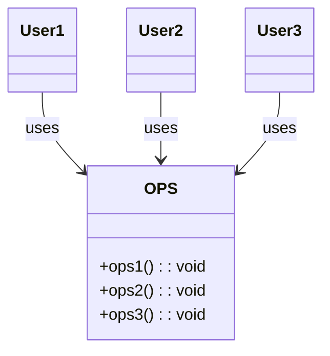
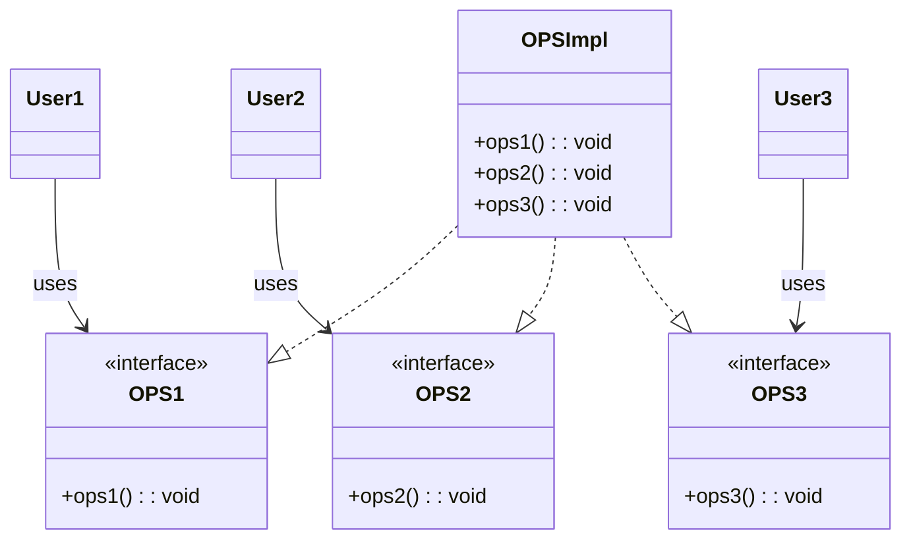

# ISP: 인터페이스 분리 원칙

위와 같은 다이어그램에서 `User1`은 `ops1()`, `User2`은 `ops2()`, `User3`은 `ops3()`만을 사용한다고 하자.

이 경우 `User1`은 `ops2()`,`ops3()`을 사용하지 않는데, 의존하게 된다. 유저 2,3도 마찬가지다.

이런 문제는 인터페이스 단위로 분리해 해결할 수 있다.

## ISP와 언어

- 동적 타입 언어가 더 유연하며 결합도가 낮을 시스템을 만들 수 있는 이유
  - 정적 타입 언어: 사용자에게 선언문(import, use, include 등)을 사용하도록 강제함 -> 소스 코드의 의존성이 발생, 재컴파일과 재배포가 필요함
  - 동적 타입 언어: 선언문이 존재하지 않음 -> 소스 코드의 의존성이 아예 없어, 재컴파일과 재배포가 필요 없음
    => ISP를 아키텍처가 아니라 언어와 관련된 문제로 오해할 수 있음

## ISP와 아키텍처

필요 이상으로 많은 걸 포함하는 모듈에 의존하는 것은 해로운 일이다.
-> 재컴파일과 재배포를 강제하기 때문에

위의 구조에서 S와는 전혀 상관없는 기능이 D에 포함된다고 가정하자.

그 기능 떄문에 D 내부가 변경되면 F를 재패포해야 할 수도 있고, S까지 재배포해야할 수도 있다.

D의 내부기능 중 F와 S에서 불필요한 그 기능에 문제가 발생해도 F와 S에 영향을 준다는 사실

## 결론

불필요한 짐을 실은 무언가에 의존하면 예상치도 못한 문제에 빠진다는 사실이다.