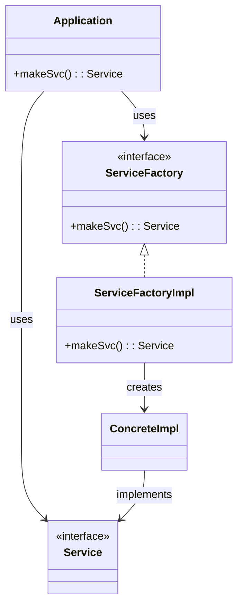

# DIP: 의존성 역전 원칙

의존성 역전 원칙에서 말하는 "유연성이 극대화된 시스템"이란, 소스코드 의존성이 "추상"에 의존하며 "구체"에 의존하지 않는 시스템

= 정적 타입언어에서는 선언문은 오직 인터페이스나 추상 클래스같은 추상적인 것만 참조해야 한다는 뜻

이 아이디어를 규칙으로 보기는 확실히 비현실적이다. 소프트웨어 시스템이라면 구체적인 많은 장치에 의존하기 때문이다.
(e.g. java - String)

String은 매우 안정적

이러한 이유로 DIP를 논할 때 운영체제나 플랫폼 같이 안정성이 보장된 환경에 대해서는 무시하는 편이다.
우리가 의존하지 않도록 피하고자 하는 것은 바로 변동성이 큰 구체적인 요소(=우리가 열심히 개발하는 중이라 자주 변경될 수 밖에 없는 모듈)다.

## 안정된 추상화

- 인터페이스는 구현체보다 변동성이 낮다.
  - 추상 이넡페이스에 변경이 생기면, 구현체들도 따라서 수정해야함
  - 반대로 구현체 변경이 생겨도 인터페이스는 변경되지 않음

- 인터페이스를 변경하지 않고, 구현체에 기능을 추가할 수 있는 방법을 찾기 위해 노력함

= 즉 안정된 소프트웨어 아키텍처란 변동성이 큰 구현체에 의존하는 일은 지양하고, 안정된 추상 인터페이스를 선호하는 아키텍처라는 뜻

- 요약
    - 구체 클래스를 참조하지 말고, 추상 인터페이스를 참조해라: 객체 생성 방식을 강하게 제약하며, 일반적으로 추상 팩토리를 사용하도록 강제
    - 구체 클래스로주터 파생하지 말라: 정적 타입 언어에서 상속은 소스코드에 존재하는 모든 관계중에서 가장 강력한 동시에 뻣뻣해 변경이 어렵다. 신중히 사용할것
    - 구체 함수를 오버라이드 하지 말라: 차라리 추상함수로 선언하고 구현체들에게서 각자의 용도에 맞게 구현해야 한다.
    - 구체적이며 변동성이 크다면 그 이름을 절대 언급하지 말라

## 팩토리

이 규칙들을 준수하려면 변동성이 큰 구체적인 객체는 특별히 주의해서 생성해야함

대다수의 객체지향 언어에서 바람직하지 못한 의존성을 처리할 때 팩토리 메서드를 사용함

- `Application`은 `ServiceFactory` 인터페이스를 통해, `makeSvc()`를 호출해 서비스 객체를 요청
- `ServiceFactoryImpl이` 실제로 `ConcreteImpl`을 생성
- `ConcreteImpl`은 `Service` 인터페이스를 구현

-> 이렇게 구성함으로써 Application은 ConcreteImpl에 대한 직접적인 의존이 없음 
`ServiceFactoryImpl`, `ConcreteImpl`과 나머지를 나눈 경계는 아키텍처 경계를 뜻함

## 구체 컴포넌트
