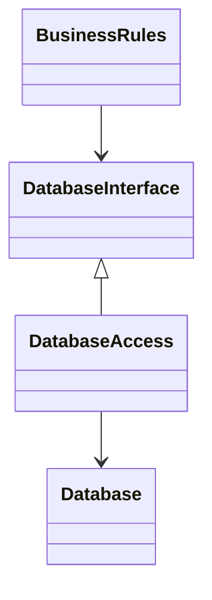
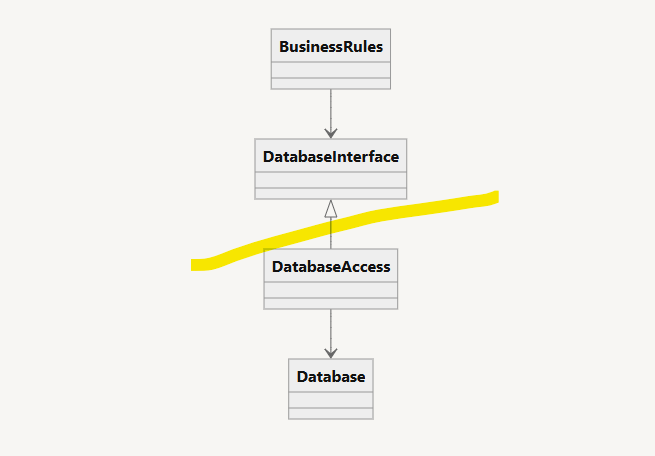
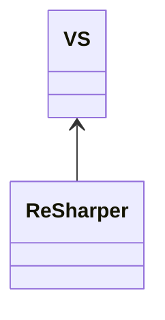

# 17장 경계: 선 긋기

소프트웨어 아키텍처는 선을 긋는 기술이다. 

- 경계는 소프트웨어 요소를 서로 분리해서 결합도를 낮춘다.
    - 한쪽 요소가 다른 쪽을 알지 못하도록 만드는 것

선은 일부는 **초기**에 (코드 작성 전) 그어진다.

- 결정을 미루기 위함
- 핵심 업무 로직을 기술적인 세부사항으로부터 격리

### **아키텍트의 최종 목표**

필요한 시스템을 만들고 유지하는 데 드는 인적 자원 최소화

인적 자원의 낭비를 일으키는 핵심 원인 

⇒ 결합(coupling)

특히 **너무 이른 결정** 으로 인한 결합이 가장 위험하다.

### **이른 결정**

시스템의 업무 요구사항, 즉 유스케이스와 아무런 관련이 없는 결정

- 프레임워크
- 데이터베이스
- 웹 서버
- 유틸리티 라이브러리
- 의존성 주입에 대한 결정 등

이런 결정은 부수적이며, 최후의 순간까지 연기할수록 좋다. 

## 두 가지 슬픈 이야기’

이른 결정으로 인한 실패 사례 2개

### **1. P사의 사례**

**배경**

- 모노리틱 데스크톱 애플리케이션 개발 → 대성공!
- 1990년대 후반: 웹 전환 압박 → 웹 버전 필요

**대응**

- 자바 프로그래머 다수 고용
- 자사 제품을 웹 기반 3티어 시스템으로 변환 시도
- 서버 팜을 통한 분산 시도
    - GUI를 위한 서버
    - 미들웨어 서버
    - 데이터베이스 서버

**문제**

- 모든 도메인 객체가 세 가지 인스턴스를 가져야 한다고 이른 결정을 내림
    - GUI 티어
    - 미들웨어 티어
    - 데이터베이스 티어
- 세 인스턴스는 서로 다른 머신에 상주했기 때문에, 프로세서/티어 간 통신이 필요

**결과**

- 리치 시스템이 구성!
- 티어 간 메서드 호출은 객체로 변환하여, 직렬화 한 후, 회선을 통해 마샬링되었다.

**레코드에 새로운 필드를 추가한다면?**

⇒ 해당 필드를 세 티어에 있는 클래스 모두와 티어 간 메시지 다수에 추가

⇒ 데이터는 양방향으로 이동하므로 메시지 프로토콜은 반드시 네 개를 추가 설계

⇒ 각 프로토콜은 송신부와 수신부를 가지므로 프로토콜 핸들러는 총 여덟 개가 필요

⇒ 세 개의 실행 파일이 빌드되어야 하며, 각 실행 파일은 변경된 세 개의 업무 객체와 네 개의 새로운 메시지, 그리고 여덟 개의 새로운 핸들러를 포함 

결국 프로그래머들은 서버 팜을 확보할 수 없었고, 세 개의 실행 파일 모두를 단일 장비에서, 세 개의 서로 다른 프로세스로 실행했다. 

그럼에도 그들은 서버 팜을 기대하며

- 옳은 아키텍처를 선택했다고 확신
- 단일 머신에서도 비효율적인 구조를 수년간 유지

했지만 서버 팜을 필요로 하는 시스템을 한 번도 판매하지 못했다.

### **2.** W사

**배경**

- 정리가 안 된 개발 환경을 개선하고자 아키텍트를 고용.
- 이 아키텍트는 필요 이상으로, 너무 이르게 서비스 지향 아키텍처를 도입

**문제**

- 도메인 객체 과잉 설계
    - 모든 업무 개념을 복잡한 도메인 객체로 설계
    - 그 객체들을 관리하는 서비스들을 대거 생성

**결과**

- 엄청난 양의 인적 시간에 따른 비용 소비

**예시: 연락 담당자 정보 추가하려면**

1. `ServiceRegistry`에서 `ContactService` 의 서비스ID 요청
2. `CreateContact` 메시지를 `ContactService` 로 전송 (필드는 수십 개)
    - 실 데이터는 이름, 주소, 전화번호 3개 → 나머지는 가짜로 채움
3. 새롭게 생성된 연락 담당자의 ID를 판매 레코드에 밀어 넣은 다음 `UpdateContact` 메시지를 `SaleRecordService`로 전송
    
    
    **새로운 기능을 추가하려면?**
    
    →  모든 서비스 사이의 결합으로 인해 엄청난 양의 WSDL(Web Services Description Language)을 변경
    
    → 변경에 영향받는 모든 것을 다시 배포
    

## FitNesse

**배경**

- Fit을 기반으로 간단한 위키 페이지 구상
- 목표: 단일 jar 파일로 배포

**전략**

1. 웹 서버를 직접 작성
    - 기본 뼈대만 갖춘 웹 서버는 구현이 간단함
    - 어떤 웹 프레임위크를 사용할지에 대한 결정을 나중으로 연기할 수 있음
2. 데이터베이스를 결정하지 않음
    - 어떤 데이터베이스를 사용하더라도 상관없도록 `WikiPage`라는 인터페이스 사용
    - 처음
        - `MockWikiPage`라는 이름의 클래스를 만들고, 그 안의 데이터 접근 메서드들은 단순히 스텁으로 사용
    - 실제로 데이터에 접근 필
        - `WikiPage`의 파생 클래스를 `InMemoryPage`를 만들어 위키페이지의 해시 테이블을 관리하는 형태로 데이터 접근 메서드를 구현
    - DB 접근 필요
        - 파일 기반 저장소`FileSystemWikiPage` 구현
    - MySQL이 필요하면?
        - 인터페이스 기반 구조 덕분에 MySQL 버전 `MySqlWikiPage` 파생 클래스만 만들면 됨

→ 결국 아무도 MySQL 버전 안 씀. 애초에 선택을 늦춘 덕분에 낭비 없음.

업무 규칙과 데이터베이스 사이에 경계선을 긋고,  이 경계선을 통해 업무 규칙은 데이터 접근 메서드 외에는 데이터베이스에 관해서 어떤 것도 알지 못하게 되었다. 덕분에 개발 동안 데이터베이스 관련 문제들을 마주치지 않고, 테스트 속도를 향상시킬 수 있었다. 

## 어떻게 선을 그을까? 그리고 언제 그을까?

👉 관련이 있는 것과 없는 것 사이에 선을 긋는다. 

**경계선**

- 경계선은 소프트웨어의 구성 요소 간 '의존'과 '관심사'를 구분 짓는 선
- 이 선은 한쪽이 다른 쪽에 의존하거나 침범하지 않도록 차단

많은 사람들이 업무 규칙이 곧 DB 구조라고 착각함 → ❌ 잘못된 생각!

- 데이터베이스는 업무 규칙이 간접적으로 사용할 수 있는 도구
- 업무 규칙은 스키마, 퀴리 언어, 또는 데이터베이스와 관련된 나머지 세부사항에 대 알 필요 없다.
- 업무 규칙이 알아야 할 것은 데이터를 가져오고 저장할 때 사용할 수 있는 함수 집합이 있다는 사실이 전부다.

- 업무 규칙`BusinessRules`은 DB에 대해 아는 게 없음
    - `DatabaseInterface`만 알음
- 실제 DB 조작은 `DatabaseAccess`가 담당 (구현체)
- `DatabaseAccess`는 `DatabaseInterface`를 구현

경계선은 `DatabaseInterface`바로 아래에 그어진다

`DatabaseAccess`에서 출발하는 두 화살표를 보면  `DatabaseAccess`클래스로부터 바깥쪽으로 향한다. 즉, 이 도표에서 `DatabaseAccess`가 존재한다는 사실을 알고 있는 클래스는 없다는 뜻이다.

의존 방향이 `Database`→ `BusinessRules`

- `BusinessRules`에게 있어 `Database`는 문제가 되지 않지만, `Database`는 `BusinessRules`없이는 존재할 수 없다
- `BusinessRules`에서는 어떤 종류의 데이터베이스도 사용할 수 있고 `Database`컴포넌트는 다양한 구현체로 교체될 수 있다.
    - 데이터베이스에 대한 결정은 연기할 수 있으며, 데이터베이스를 결정하기에 앞서 업무 규칙을 먼저 작성하고 테스트하는 데 집중할 수 있다.

## 입력과 출력은?

사람들은 GUI를 보면 시스템이라고 착각한다. 하지만 **입출력(GUI)은 중요하지 않다. 중요한 건 업무 규칙이다.**

**예시: 비디오 게임 모델**

사용자 경험은 인터페이스에 의해 좌우되고 이를 시스템이라고 착각한다. 

- 화면, 마우스, 버튼, 음향

진짜 시스템은 인터페이스를 조작하는 모델

- 모델은 인터페이스를 전혀 필요로 하지 않는다.
- 화면에 전혀 출력되지 않더라도 모델은 주어진 역할을 충실하게 수행
- 모델에게 중요한 것은 업무 규칙이다.

관련성이 낮은 컴포넌트가 관련성이 높은 컴포넌트에 의존한다

**GUI가 BusinessRules를 의존한다**

- BusinessRules는 GUI에 대해 아무것도 모름
- GUI는 어떤 식으로든 변경할 수 있음
- BusinessRules는 로직만 충실히 수행하면 됨

## 플러그인 아키텍처

소프트웨어 개발 기술의 역사는 플러그인을 손쉽게 생성하여, 확장 가능하며 유지보수가 쉬운 시스템 아키텍처를 확립할 수 있게 만드는 방법에 대한 이야기다.

선택적이거나 또는 수많은 다양한 형태로 구현될 수 있는 나머지 컴포넌트로부터 핵심적인 업무 규칙은 분리되어 있고, 또한 독립적이다

플러그인 아키텍처 덕분에 세부사항이 바뀌어도 핵심 로직에 영향이 없다. 

- GUI
    - 플러그인 형태로 고려되어 수많은 종류의 사용자 인터페이스를 플러그인 형태로 연결할 수 있다.
    - 웹, 콘솔, 데스크탑 등
- 데이터베이
    - SQL, NoSQL, 파일 시스템 등으로 대체 가능

교체가 쉬운건 아니지만 경계를 잘 설정해 두면 변경이 가능하다. 

## 플러그인에 대한 논의

- ReSharper는 Visual Studio에 의존한다.
- 반대로, Visual Studio는 ReSharper에 의존하지 않는다.

Visual Studio 팀은 ReSharper의 존재를 신경 쓰지 않아도 되지만, ReSharper 팀은 Visual Studio의 변경에 항상 영향을 받는다.

**이런 비대칭 관계야말로 우리가 원하는 의존성 구조**

**플러그인 아키텍처의 이점**

- 변경 전파를 막는 방화벽
    - 특정 모듈이 나머지 모듈에 영향받지 않는다.
    - GUI나 DB 같은 요소가 변경돼도 **업무 규칙(Business Rules)** 에 영향 없음
    - 시스템에서 한 부분이 변경되더라도 관련 없는 나머지 부분이 망가지지 않는다.

**경계는 '변경의 축(axis of change)'이 있는 지점 그어진다.**

- GUI와 업무 규칙은 서로 다른 이유, 다른 타이밍으로 변경됨 → 경계 필요
- 업무 규칙과 DI 프레임워크도 다른 변경 축을 가짐 → 경계 필요
- 이러한 구분은 곧 단일 책임 원칙(SRP)에 해당한다..

## 결론

소프트웨어 아키텍처에서 경계선을 그리려면

1. 시스템은 컴포넌트 단위로 분할되어야 한다.
    - 일부 컴포넌트: 핵심 업무 규칙
    - 나머지 컴포넌트: 플러그인
        - 핵심 업무와는 직접적인 관련이 없지만 필수 기능을 포함
        - 핵심 업무를 향하도록 이들 컴포넌트의 소스를 배치

**의존성 화살표는 저수준 세부사항에서 고수준의 추상화를 향하도록 배치된다.**