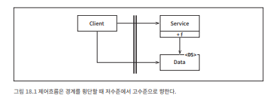
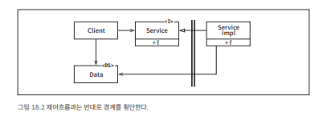

# 18장 경계 해부학

시스템 아키텍처는 일련의 소프트웨어 컴포넌트와 그 컴포넌트들을 분리하는 경계에 의해 정의되고 이 경계는 다양한 형태를 가진다. 

## 경계 횡단하기

**런타임에 경계를 횡단한다**

: 경계 한쪽에 있는 기능에서 반대편 기능을 호출하여 데이터를 전달하는 일

GUI → Business Rules, Business Rules → DB Acces 같은 호출

적절한 위치에서 경계를 횡단하려면 소스 코드 의존성 관리해야 한다. 

- **소스 코드 수준**에서 경계를 관리 할까?
    - 소스 코드 모듈 하나가 변경되면, 이에 의존하는 다른 소스 코드 모듈도 변경하거나, 다시 컴파일해서 새로 배포해야 할 수 있기 때문
    - 경계는 이러한 변경이 전파되는 것을 막는 방화벽을 구축하고 관리하는 수단으로써 존재한다.

## 두려운 단일체

**단일체**

- 함수와 데이터는 같은 주소 공간 공유(소스 수준 분리 모드)
- 배포 시
    - 하나의 실행 파일로 보임 (Jar, EXE 등)
    - 단일 실행 파일이더라도 컴포넌트별 독립 개발/빌드이 가능한 것은 가치가 있다.

**단일체 아키텍처는 거의 대부분 동적 다형성(OOP) 의존해서 내부 의존성을 관리한다.**

- 객체 지향 개발이 아주 중요한 패러다임이 될 수 있었던 이유
- 객체 지향/다형성 없었다면? → 함수 포인터 기반 접근(위험) → 분리 어려움.

**가장 단순한 경계 횡단**

- 제어흐름: 저수준 → 고수준 호출.
- 런타임 & 컴파일타임 의존성 방향 동일 (Client → Service).
- **경계에서 호출되는 쪽에 Data에 대한 정의가 위치한다**

**고수준 클라이언트가 저수준 서비스를 호출해야 한다면?**

동적 다형성을 사용하여 제어 흐름과는 반대 방향으로 의존성을 역전시킬 수 있다. 

- 고수준 클라이언트가 저수준 서비스를 직접 의존하지 않고, 인터페이스를 의존.
- 이렇게 하면 런타임 의존성은 컴파일타임 의존성과는 반대가 된다.
    
    
    
    - **제어 흐름**: 여전히 고수준 → 저수준 (실행 시, 왼쪽 → 오른쪽).
        - Client는 Service 인터페이스를 통해 저수준인 ServiceImpl의 함수 f()를 호출
    - **소스 의존성**: 저수준 → 고수준 (컴파일 시, 오른쪽→ 왼쪽).
        - 데이터 구조의 정의가 호출하는 쪽에 위치

정적 링크된 모노리턱 구조의 실행 파일이라도 

**규칙적인 방식으로 구조를 분리하면** 

- 프로젝트 개발, 테스트, 배포하는 작업에 용이
- 팀별로 독립 작업 가능 → 서로 영역 침범 없음.
- 고수준 컴포넌트는 저수준 세부사항으로부터 독립 유지.

**단일체 아키텍처의 특성**

- 컴포넌트 간 통신 = **단순 함수 호출** → **매우 빠르고 비용 낮음**.
- 소스 수준에서 결합이 분리되면 경계를 가로지르는 통신은 상당히 빈번할 수 있다.
- 경계가 소스 수준에서 유지되면 **빈번한 호출도 문제 없음**.

**배포**

- 보통 컴파일 + 정적 링크 과정 필요.
- 대체로 단일체  시스템에서 컴포넌트는 보통 소스 코드 형태로 전달된다.

## 배포형 컴포넌트
**물리적 경계가 있는 형태**

- 동적 링크 라이브러리
    
    → NET DLL, 자바 jar 파일, 루비 젬Gem, 유닉스 공유 라이브러리 등
    
- 컴포넌트를 바이너리로 배포하여 별도의 컴파일 없이 사용할 수 있다.
- 배포 수준에서 결합이 분리된 형태 → 배포 수준 결합 분리 모드.
    - 배포는 편의를 위해 WAR 파일, 디렉터리 묶음 등으로 진행.

**단일체와 유사한 점**

- 대부분의 함수는 동일한 프로세스와 주소 공간에서 동작.
- 의존성 관리 전략도 단일체와 동일.
- 통신 방식도 동일 → 함수 호출 기반.

## 스레드

단일체와 배포형 컴포넌트는 모두 스레드를 활용할 수 있다.

- 스레드는 아키텍처 경계도, 배포 단위도 아니다.
    - 단지 실행 계획과 순서를 체계화하는 도구.
- 위치
    - 한 컴포넌트 내에 포함
    - 여러 컴포넌트에 걸쳐 분산

## 로컬 프로세스

강한 물리적 형태를 띠는 아키텍처 경계

- 명령행이나 그와 유사한 시스템 호출을 통해 생성
- 로컬 프로세스는 동일한 프로세서/멀티코어에서 실행되지만, 각각이 독립된 주소 공간에서 실행된다.
- 메모리 보호로 인해 기본적으로 메모리 공유 불가 (필요 시 공유 메모리 파티션 사용).
- 통신
    - 운영체제에서 제공하는 통신 기능 이용
        - 소켓(Socket)
        - 메일박스(Mailbox)
        - 메시지 큐(Message Queue)
- 로컬 프로세스 구성
    - 정적 링크된 단일체
        - 여러 모노리틱 프로세스가 같은 컴포넌트들을 가지고 있을 수 있다
    - 동적 링크된 여러 개의 컴포넌트
        - 동적으로 링크된 배포형 컴포넌트들을 서로 공유할 수 있다.
        
- 로컬 프로세스는 최상위 컴포넌트다.
    - 동적 다형성 기반의 저수준 컴포넌트로 구성
    - 로컬 프로세스 간 분리 전략은 단일체나 바이너리 컴포넌트의 경우와 동일하다.
        - 소스 코드 의존성: 저수준 → 고수준
        - 고수준 프로세스가 저수준 프로세스의 세부사항을 알면 안 됨.
        - 저수준 프로세스를 고수준의 플러그인 형태로 유지가 목적
- 경계 횡단 비용 → **높음**
    - 운영체제 호출, 데이터 마샬링/언마샬링, 문맥 교환
    - 따라서 프로세스 간 통신은 신중해야 한다.

## 서비스

물리적인 형태를 띠는 가장 강력한 경계

- 명령행 또는 시스템 호출을 통해 구동.
- 물리적 위치에 구애받지 않음
    - 동일한 프로세서나 멀티코어에서 동작
    - 아닐 수도 있음
    - 같은 서버, 전혀 다른 데이터센터
- 서비스들은 모든 통신이 네트워크를 통해 이뤄진다고 가정한다.
- 특징
    - 네트워크 기반 → 매우 느린 통신(함수 호출 대비)
        - 지연: 수십 ms ~ 수 초
    - 따라서
        - 빈번한 통신은 피해야 함.
        - 통신 시 지연에 따른 문제를 고수준에서 처리할 수 있어야 한다.
- 로컬 프로세스에 적용한 규칙이 서비스에도 그대로 적용된다.
    - 의존성 방향: 저수준 → 고수준.
    - 저수준 서비스는 고수준 서비스의 플러그인이어야 함.
    - 고수준 서비스 소스 코드에 저수준 서비스의 물리적 정보(예: URI) 포함 금지.

## 결론

단일체를 제외한 대부분의 시스템은 **여러 경계 전략을 사용**한다.

- 예: 서비스 경계 + 로컬 프로세스 경계 + 소스 코드 수준 경계.

핵심은 경계를 어디에 두느냐!

👉 **빈번한 호출이 필요한 부분은 가까이, 변경 축이 다른 부분은 확실히 분리.**