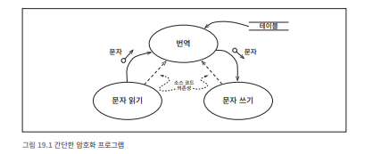
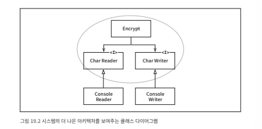

# 19장 정책과 수준

소프트웨어 시스템은  정책을 기술한 것이다.

프로그램은 입력을 출력으로 변환하는 정책을 상세하게 설명한 설명서다.

- 하나의 정책은 작은 단위의 정책들로 나눌 수 있다.
    
    예시
    
    - 집계 관련 규칙 처리 정책
    - 특정 보고서 포맷 정책
    - 입력 데이터 검증 정책

아키텍처를 개발하는 기술에는 이러한 정책을 분리하고, 정책이 변경되는 양상에 따라 정책을 재편성하는 일도 포함된다.

- 변경 기준
    - **같은 이유/시점**에 변경되는 정책 → 동일한 컴포넌트, 동일한 수준에 배치.
    - **다른 이유/시점**에 변경되는 정책 → 다른 컴포넌트로 분리.
- 보통 아키텍처는 비순환 방향 그래프(DAG)로 표현된다.
    - **정점(node)**: 동일한 수준의 정책을 포함하는 컴포넌트.
    - **간선(edge)**: 컴포넌트 간 의존성.
    

의존성은 컴파일러가 제대로 동작하기 위해서 필요하고, 좋은 아키텍처라면 저수준 컴포넌트가 고수준 컴포넌트에 의존하도록 설계되어야 한다.

## 수준

입력과 출력까지의 거리. 

입력·출력에 가까울수록 저수준, 멀어질수록 고수준이다.



데이터 흐름

- 굽은 실선. 정보가 이동하는 방향.
- 테이블 참조 → 문자 번역 → 번역된 문자 출력

소스 코드 의존성

- 점선

번역 컴포넌트

- 입력과 출력에서 부터 가장 멀리 떨어져 있는 최고 수준의 컴포넌트

❗데이터 흐름과 소스 코드 의존성이 항상 같은 방향을 가리키지는 않는다❗

소스 코드 의존성은 그 수준에 따라 결합되어야 하며, 데이터 흐름을 기준으로 결합되어서는 안 된다. 

**잘못된 예**

```java
function encrypt() {
    while(true)
        writeChar(translate(readChar()));
}
```

❌ 고수준 정책 `encrypt`가 저수준 정책 `readChar`, `writeChar`에 직접 의존

**개선된 구조**



- Encrypt 클래스와 CharReader / CharWriter 인터페이스(추상화)
    - 저수준에서 고수준을 향하는 의존성
- ConsoleReader/ConsoleWriter는 저수준 컴포넌트로 분리.
- 이로 인해 암호화 정책은 I/O 변화에 영향을 덜 받음.

**정책을 컴포넌트로 묶는 기준은 정책이 변경되는 방식에 달려있다**

- 정책 변경은 빈도와 중요도에 따라 다르게 발생한다.
    - 저수준 정책: I/O 장치 변경 등 더 자주, 덜 중요한 이유로 변경됨.
    - 고수준 정책: 알고리즘 변경 등 덜 자주, 보다 중요한 이유로 변경됨.
- 의존성 방향을 고수준으로 모으면 저수준 변경이 상위 정책에 미치는 영향이 최소화된다.

**컴포넌트 플러그인 구조**

- 저수준 컴포넌트는 고수준 정책에 플러그인 되어야 한다.
- 고수준 컴포넌트는 저수준 구현 세부사항을 **알 필요가 없다**.
    - Encryption 컴포넌트는 IO Devices를 모르지만, IO Devices는 Encryption에 의존한다.