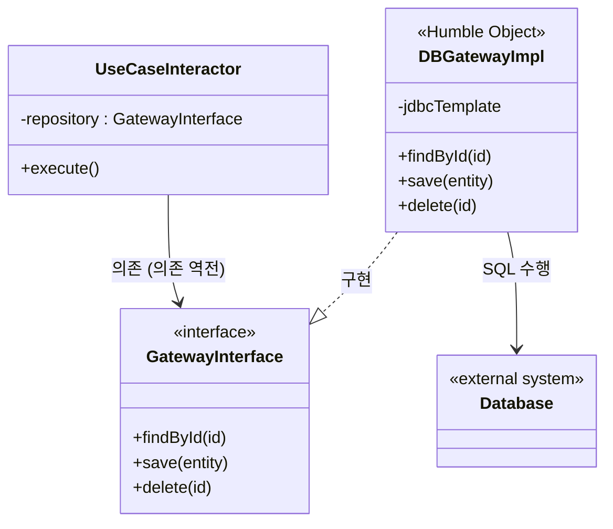

# 23장 프레젠터와 험블 객체

22장에서 소개한 프레젠터는 험블 객체 패턴을 따른 형태로, 아키텍처 경계를 식별하고 보호하는데 도움이 된다.

## 험블 객체 패턴

- 의미

  - 디자인 패턴
  - 테스트하기 어려운 행위와 쉬운 행위를 단위 테스트 작성자가 쉽게 분리하는 방법으로 고안된 것
- 내용

  ```mermaid
  classDiagram
  class HumbleObject {
      <<Humble>>
      +handleInput()
      +display()
      -component : TestableComponent
  }

  class TestableComponent {
      +process()
      +generateOutput()
  }

  class ExternalSystem {
      <<External>>
      +callAPI()
  }

  HumbleObject --> TestableComponent : 위임(delegates)
  TestableComponent --> ExternalSystem : 사용(uses)
  ```

  - 행위들을 두 개의 모듈 또는 클래스로 나누며, 이 중 하나가 험블(humble)
  - 가장 기본적인 본질은 남기고, 테스트하기 어려운 행위를 모두 험블 객체로 옮김
  - 나머지 모듈에는 험블 객체에 속하지 않는, 테스트가 쉬운 행위들을 모두 옮김
  - 예시: GUI 테스트, 화면의 각 요소가 적절한 위치에 표시되는건지 검사하는 것이 어려움
    - 험블 객체 패턴 이용시, 행위를 분류하여 presenter와 view라는 서로 다른 클래스로 만들 수 있음

## 프레젠터와 뷰

- 뷰(view): 험블 객체, 테스트하기 어려움, 데이터를 이동시키지만 처리하지는 않음
- 프레젠터(presenter): 애플리케이션으로부터 데이터를 받아 화면에 표현할 수 있는 포맷으로 만드는 것
- 예시

  - 애플리케이션에서 어떤 필드에 날짜를 표시한다면

  ```mermaid
  sequenceDiagram
  participant 애플리케이션
  participant 프레젠터
  participant 뷰

  애플리케이션->>프레젠터: Date 객체 전달
  프레젠터->>프레젠터: 날짜 포맷 문자열 생성
  프레젠터->>프레젠터: 뷰모델 생성
  프레젠터-->>뷰: 뷰모델 전달
  뷰->>뷰: 뷰모델에서 포맷된 날짜 읽기
  뷰-->>사용자: 날짜 표시
  ```
    - 애플리케이션: 프레젠터에 Date 객체를 전달
    - 프레젠터: 데이터를 전달할 적절한 포맷의 문자열을 만들고, 뷰모델(view model) 생성
    - 뷰: 뷰 모델에서 이 데이터를 찾음
  - 애플리케이션에서 금액을 표시하고자 한다면

    ```mermaid
    sequenceDiagram
      participant 애플리케이션
      participant 프레젠터
      participant 뷰

      애플리케이션->>프레젠터: Currency 객체 전달
      프레젠터->>프레젠터: 금액 포맷 변환 (e.g. ₩1,000.00)
      프레젠터->>프레젠터: 음수 여부 boolean 저장
      프레젠터->>프레젠터: UI 제어용 boolean/enum 플래그 설정
      프레젠터->>프레젠터: 뷰모델 생성
      프레젠터-->>뷰: 뷰모델 전달
      뷰->>뷰: 뷰모델에서 값 로드
      뷰-->>사용자: 금액 표시 및 UI 상태 반영
    ```
    - 애플리케이션: 프레젠터에 Currency 객체를 전달
    - 프레젠터
      - 해당 객체를 소수점과 통화 표시가 된 포맷으로 변환 후 뷰 모델에 저장
      - 만약 금액이 음수일 때를 알아야 한다면 이를 boolean 값으로 저장
      - 만약, 화면의 각 요소(e.g. 버튼, 라디오 버튼, 체크박스 등)에 대해 활성화/비활성화를 제어해야한다면, 이에 대한 적절한 boolean 타입 플래그로 뷰모델에 저장
        - 화면에 표시되며 애플리케이션에서 일정 부분 제어할 수 있는 요소라면, 뷰 모델 내부에 문자열, boolean, enum 형태로 표현
    - 뷰: 뷰 모델의 데이터를 화면으로 로드하는 것이 전부
## 테스트와 아키텍처- 험블 객체 패턴: 행위를 테스트하기 쉬운 부분/어려운 부분을 나누는 패턴 -> 테스트 용이성이 좋음, 이렇게 분리하면 아키텍처 경계가 정의됨
  - 테스트 용이성은 좋은 아키텍처가 지녀야 할 속성
  - 프레젠터와 뷰 사이 경계는 테스트 하기 쉬운 부분/어려운 부분의 경계 중 하나


## 데이터베이스 게이트웨이

> **유스케이스 인터랙터**와 **데이터베이스** 사이에는 **데이터베이스 게이트웨이**가 위치
>

- 데이터베이스 게이트웨이: 다형적 인터페이스, 애플리케이션이 데이터베이스에서 수행하는 작업과 관련된 모든 메서드를 포함
- 유스케이스 인터랙터
  - SQL을 허용하지 않고, 필요한 메서드를 제공하는 게이트웨이 인터페이스를 호출
  - 험블객체가 아님, 특화된 업무 규칙을 캡슐화하기 때문, 게이트웨이는 스텁(stub)이나, 테스트 더블 로 적당히 교체가 가능해서 테스트가 쉬움
- 게이트웨이 인터페이스 구현체는 데이터베이스 계층에 위치하며, 이는 험블 객체


## 데이터 매퍼

> 객체 관계 매퍼(Object Relational Mapper, ORM)은 존재하지 않음
>
> - 이유
>   - 객체는 데이터 구조가 아니기 때문
>   - 객체 사용자 입장: 모든 변수가 private 로, 데이터를 볼 수 없음 => 객체는 단순히 오퍼레이션 집합

- ORM 보다는 데이터 매퍼(data Mapper)라고 부르는 편이 나음
    - 관계형 데이터베이스 테이블로부터 가져온 데이터를 데이터 구조에 맞게 담아주기 때문

- ORM 시스템의 위치: 데이터베이스 계층
- ORM은 게이트웨이 인터페이스와 데이터베이스 사이에서 일종의 또 다른 험블 객체 경계를 형성
    - 테스트하기 어려운 이유: 단위 테스트에서 제어하거나 모킹하기 어렵고 외부 시스템(DB)에 의존하기 때문
    - 유스케이스/도메인과 DB를 분리해줌

## 서비스 리스너

- 어플리케이션이 다른 서비스와 통신해야한다면, 우리는 서비스 경계를 생성하는 험블 객체 패턴을 발견할 수 있다.
- 데이터 전송시
    ``` mermaid
    sequenceDiagram
        participant 애플리케이션
        participant 포맷터모듈 as 특정 모듈 (데이터 포맷터)
        participant 외부서비스 as 외부 서비스

        애플리케이션->>포맷터모듈: 단순 데이터 구조 전달
        포맷터모듈->>포맷터모듈: 포맷 변환 (e.g. JSON, XML 등)
        포맷터모듈->>외부서비스: 변환된 데이터 전송
    ```
    - 애플리케이션: 데이터를 간단한 데이터 구조 형태로 로드한 후 이를 특정 모듈로 전달
    - 특정 모듈: 데이터를 적절한 포맷으로 만들어서 외부 서비스로 전송
- 데이터 수신시
    ```mermaid
    sequenceDiagram
    participant 외부서비스 as 외부 서비스
    participant 서비스리스너 as 서비스 리스너
    participant 애플리케이션

    외부서비스-->>서비스리스너: 원시 데이터 수신
    서비스리스너->>서비스리스너: 애플리케이션용 포맷으로 변환
    서비스리스너-->>애플리케이션: 변환된 데이터 전달
    ```
    - 서비스 리스너: 서비스 인터페이스로부터 데이터를 수신한 뒤, 애플리케이션에서 사용할 수 있는 포맷으로 변환하여 내부로 전달


## 결론

> 각 아키텍저 경계마다 경계 가까이 숨어 있는 험블 객체 패턴을 발견할 수 있을 것이다.
> 경계를 넘나드는 통신은 거의 모두 간단한 데이터 구조를 수발할 때가 많고, 대개 그 경계는 테스트하기 어려운 무언가와 테스트하기 쉬운 무언가로 분리될 것이다.
> 그리고 이러한 아키텍처 경계에서 험블 객체 패턴을 사용하면 전체 시스템의 테스트 용이성을 크게 높일 수 있다.