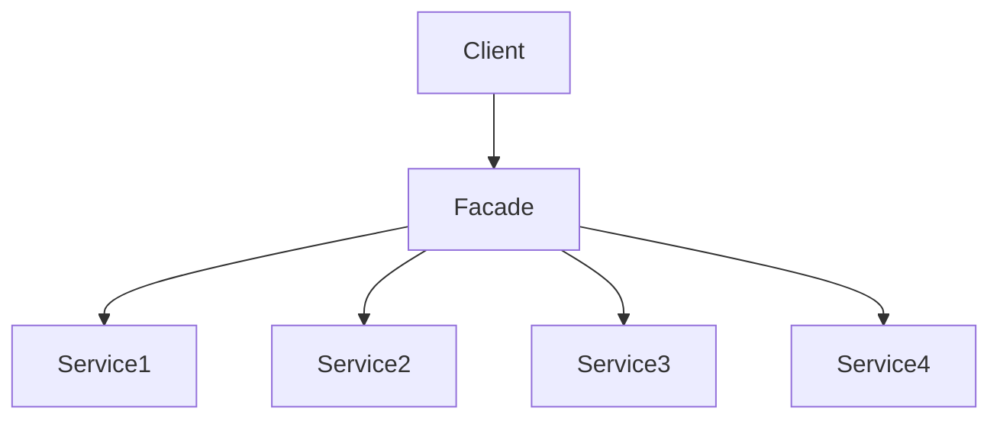

# 24장 부분적 경계

> 아키텍처 경계를 완벽하게 만드는 데는 비용이 많이 든다.
> - 쌍방향의 당형적 Boundery 인터페이스, Input과 Output을 위한 데이터 구조를 만들어야함
> - 두 영역을 독립적으로 컴파일하고 배포할 수 수 있는 컴포넌트로 격리하는 데 필요한 모든 의존성을 관리해야한다.
> - 이렇게 하려면 많은 노력이 필요하고, 유지하는데도 많은 노력이 필요함

- 고민점: 아키텍처 경계를 완벽하게하려면 비용이 많이 드는데, 나중에 필요할 것 같으니까 미리 분리하는게 좋을까?
- 일부 사람들 선행적인 설계를 탐탁치 않게 여김: YAGNI(You Aren't Going to Need It)원칙을 위배하기 때문

> YAGNI(You Aren't Going to Need It)원칙
> : “당장 필요하지 않은 기능은 구현하지 말라”는 애자일 개발의 핵심 원칙 중 하나
> 
> - 예측 기반 설계 지양: 미래에 필요할 것 같다는 이유로 기능을 미리 만들지 말 것
> -	현재 요구사항에 집중: 지금 당장 필요한 기능만 구현
> -	과도한 설계 방지: 복잡도와 유지 비용을 줄임

=> 그렇다면 부분적 경계(Partial Boundary)를 구현해 볼 수 있다.

## 마지막 단계를 건너뛰기

부분적 경계를 생성하는 방법

- 독립적으로 컴파일하고 배포할 수 있는 컴포넌트를 만들기 위한 작업은 모두 수행한 후, 단일 컴포넌트에 그대로 모아두는 것
    - -> 쌍방향 인터페이스, 입출력 구조 등의 모든 내용은 준비된 상태로 단일 컴포넌트 
    - => 실제 코드나 설계는 분리할 수 있도록 설계되었지만, 마지막 단계인 컴포넌트 분리만 진행하지 않음
    - 컴포넌트 분리를 하지 않음으로써 버전 관리, 의존성 관리, 배포 관리에 대한 부담을 줄임

- 예시: FitNess
    - 웹 서버 컴포넌트는 위키나 테스트 영역과 분리되도록 설계, 새로운 웹 기반 애플리케이션 생성시 사용자가 한 번만 다운로드하길 원해서
    - 마지막 단계를 건너뛴 위험: 시간이 지나며, 분리한 컴포넌트가 사용될 일이 없어졌고, 각 컴포넌트 사이의 구분도 약화되며, 의존성은 잘못된 방향으로 진행됨

## 일차원 경계

- 완벽한 형태의 아키텍처 경계: 양방향으로 격리된 상태를 유지해야 함, 쌍방향 Boundary 인터페이스를 사용
- 추후 완벽한 형태의 경계로 확장할 수 있는 공간을 확보하고자 할 때 활용할 수 있는 구조 중 전통적인 패턴은 전략 패턴
- 전략 패턴의 위험성

    ```mermaid
    graph LR
      Client --> ServiceBoundary[Service Boundary - Interface]
      ServiceImpl --> ServiceBoundary
      ServiceImpl -.-> Client
    ```
    - 아키텍처 경계를 위한 무대를 마련하지만, 빠르게 붕괴될 수 있음
    - 점선 화살표: 이런 비밀 통로가 생기는 것을 막을 방법이 없음


## 퍼사드




- Facade 클래스에는 모든 서비스 클래스를 메서드 형태로 정의하고, 서비스 호출이 발생하면 해당 서비스 클래스로 호출을 전달한다. 클라이언트는 이 서비스 클래스들을 직접 접근할 수 없음
- 하지만 클라이언트가 서비스 클래스에 대해 추이적 종속성을 가지게 됨
- 하지만 클라이언트가 서비스 클래스에 대해 추이 종속성을 가지게 됨
    - 정적 언어의 경우 서비스 클래스의 로직이 변경되면, 전체 컴파일이 필요함


## 결론
아키텍처 경계를 부분적으로 구현하는 간단한 세 가지 방법(컴포넌트 분리만 안하기, 전략 패턴, 퍼사드 패턴)를 살펴봤다.
이 외에도 다른 방법이 더 있고, 각 방식에 따라 비용과 장점을 가진다.
아키텍처 경계가 언제, 어디에 존재해야할지, 그리고 그 경계를 완벽하게/부분적으로 구현할지는 아키텍트의 역할이다.