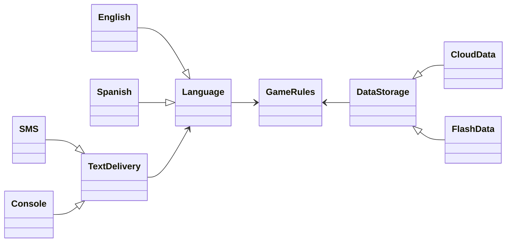
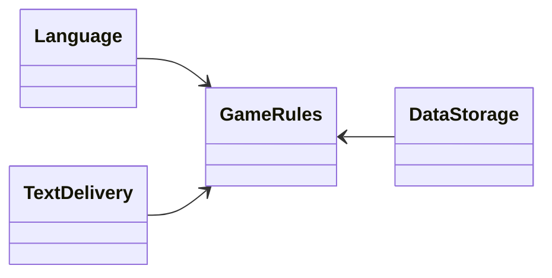
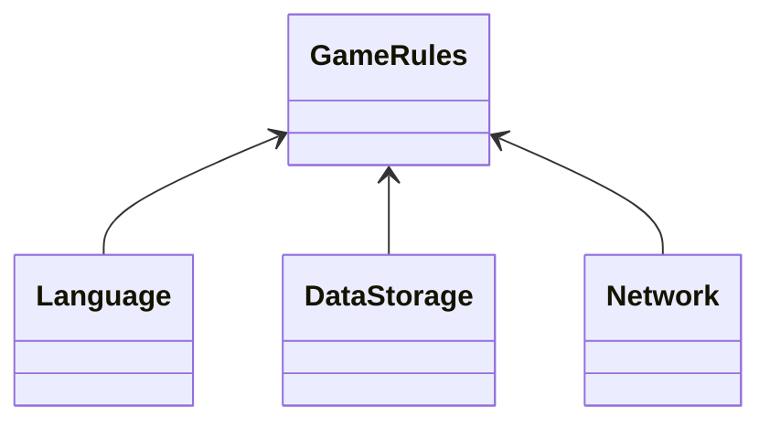

# 25장 계층과 경계

많이들 시스템을 UI, 업무 규칙(비즈니스 로직), 데이터베이스라는 세 가지 컴포넌트로 단순화해서 생각한다. 일부 단순한 시스템에서는 이 정도 구분으로 충분할 수 있지만 대다수의 실제 시스템에서는 이보다 훨씬 많은 컴포넌트와 추상화 계층이 필요하다.

## 움퍼스 사냥 게임

**Hunt the Wumpus**

### 게임 설명

- 1972년에 발매된 텍스트 기반 모험 게임.
- 플레이어는 단순한 명령어(`GO EAST`, `SHOOT WEST`)를 입력한다.
- 시스템은 플레이어가 보고, 냄새 맡고, 듣고, 경험할 수 있는 상황을 텍스트로 응답한다.
- 목표: 동굴 시스템 안에서 '움퍼스'를 사냥하고 함정이나 위험을 피하는 것.

**경계 1 : 게임 규칙과 UI를 분리해서 제품을 여러 시장에서 다양한 언어로 발매하고 싶다!**

- 게임 규칙은 언어와 독립적인 API를 사용한다.
- UI는 이 API를 호출하여 사용자에게 친숙한 언어로 변환해 보여준다.
    
    ```mermaid
    flowchart BT
        A["English UI"] --> B["Game Rules"]
        C["Spanish UI"] --> B
    ```
    
    장점: UI가 영어, 한국어, 일본어 등으로 변경되더라도 게임 규칙은 전혀 영향을 받지 않는다.
    

**경계 2: 게임의 상태를 영속적인 저장소에 유지하고 싶다!**

(저장소는 RAM, 플래시 메모리, 클라우드 등 다양할 수 있다.)

- 게임 규칙은 저장소 세부사항을 알 필요가 없으며, 알지 않아야 한다.
- 이를 위해 데이터 저장소와 통신하는 API를 생성한다.
- 저수준 저장소 구현체가 고수준 게임 규칙 인터페이스에 의존해야 한다(DIP 적용).
    
    ```mermaid
     flowchart BT
       B["Game Rules"]
        n2["Flash Data"] --> B
        n3["Cloud Data"] --> B
    
        n2@{ shape: rounded}
        n3@{ shape: rounded}
    
    ```
    

## 클린 아키텍처?

UI, 언어, 저장소를 분리했더라도 **정말 모든 아키텍처 경계를 찾았는가?**

UI에서 언어만이 변경 축(change axis)은 아니다.

- 텍스트 입출력 메커니즘도 다양하게 바뀔 수 있다.
    - 일반 콘솔, 채팅 앱 등.
- 다양한 가능성이 있고, 이 변경의 축에 의해 정의되는 아키텍처 경계가 있을 수 있다.



**Language API**

`English`, `Spanish` 이 구현.

**TextDelivery API**

- `ConsoleText`, `SMS` 이 구현.

**GameRules**

- **Language 인터페이스를 사용**해 다국어 메시지를 처리.
- Language 인터페이스를 통해 언어 구현체와 직접 의존하지 않는다.

❗API는 구현체가 아닌 사용하는 쪽(상위 수준 컴포넌트)에 정의된다.

❗**Boundary 인터페이스**는 항상 상위 수준 정책 컴포넌트에 속해야 한다.

**다형적 Boundary 인터페이스**

- `GameRules` → `Language` 간 인터페이스:
    - `GameRules`가 정의하고 `Language`가 구현.
- `Language` → `TextDelivery` 간 인터페이스:
    - `Language`가 정의하고 `TextDelivery`가 구현.
- 이렇게 하면 의존성 방향이 항상 위쪽(고수준 정책)으로 흐른다.



- 최상위에는 `GameRules`가 위치
- 데이터 흐름 1 : 사용자와 상호작용
    - 좌측 하단의 `TextDelivery`는 입력을 `Language`로 전달.
    - `Language`는 명령어를 `GameRules`가 이해할 수 있는 형태로 변환.
    - `GameRules`는 처리 후 `Language`에 응답을 보냄.
    - `Language`는 이를 적절한 언어로 번역 후, `TextDelivery`를 통해 사용자에게 반환.
- 데이터 흐름 2 : 데이터 영속성
    - `GameRules`는 처리 후 `DataStorage`에 데이터를 보냄.
    - `GameRules`는 `Language`에 응답을 보냄.
    - `Language`는 이를 적절한 언어로 번역 후, `TextDelivery`를 통해 사용자에게 반환.

중앙의 GameRules는 두 흐름의 교차점이고  입력과 응답을 처리한다.

## 흐름 횡단하기

데이터 흐름은 시스템이 확장되면 새로운 흐름이 추가될 수 있다.

만약 움퍼스 사냥 게임에 멀티플레이어 버전이 추가된다면



- Network 컴포넌트가 추가된다.

데이터 흐름은 세 개가 되고 이 흐름은 GameRules에서 제어한다.

## 흐름 분리하기

단순히 모든 흐름이 GameRules 하나로만 수렴할 것이라고 생각할 수 있지만 현실에서는 GameRules 내부에도 여러 수준의 정책 집합이 존재한다.

**GameRules 내부의 정책 계층**

1. 저수준 정책 (MoveManagement)
    - 동굴 간 연결, 물체 배치, 이동 규칙, 이벤트 트리거 등을 담당.
2. 고수준 정책 (PlayerManagement)
    - 플레이어의 생명력 관리, 자원 소비/획득, 승리 조건 등을 관리.
    - 저수준 정책에서 발생하는 사건( `FoundFood`, `FellInPit`)을 받아 처리.
    
    ```mermaid
    classDiagram
    direction BT
    		MoveManagement --> PlayerManagement
        Language --> MoveManagement
        DataStorage --> MoveManagement
        Network --> MoveManagement 
        
       
    ```
    

**마이크로서비스 추가 - 대규모 플레이어 지원**

- MoveManagement: 플레이어의 로컬 컴퓨터에서 실행.
- PlayerManagement: 서버에서 실행되며, 모든 클라이언트의 상태를 관리.
- MoveManagement ↔ PlayerManagement 간에 완벽한 아키텍처 경계가 생긴다.
    - PlayerManagement는 접속된 모든 MoveManagement 컴포넌트에 마이크로서비스 API를 제공
    
    ```mermaid
    classDiagram
    direction LR
    		PlayerManagementImp --> PlayerManagement
    		PlayerManagementProxy --> PlayerManagement
    		PlayerManagement <-- MoveManagement
    		
        MoveManagement <-- Language
        MoveManagement <-- DataStorage 
        
        Network1 --> PlayerManagementImp 
        Network2 --> PlayerManagementProxy 
    ```
    

## 결론

**작은 프로그램에도 아키텍처 경계는 존재한다.** 

아키텍트의 역할은 어떤 경계가 필요한지, 언제 구현할지 신중히 판단하는 것.

**경계 구현은 비용이 많이 든다.**

추상화 계층 추가, 인터페이스 정의, 테스트 작성 등.

**경계가 무시되었다가 나중에 추가하는 비용은 훨씬 더 크다.**

리팩토링이 어렵고 위험이 커진다. (포괄적인 테스트 스위트(test-suite)가 있어도 동일)

**YAGNI(You Aren’t Going to Need It)**

필요하지 않을 추상화나 경계를 미리 구현하지 마라. 오버 엔지니어링이 언더 엔지니어링보다 더 해로울 수 있다.

그러나 필요한 경계를 나중에 추가하는 것은 매우 비싸다. 아키텍트는 경계가 지금 필요한지, 나중에 필요할지를 예측하고 관찰해야 한다.

- 경계에 대한 판단은 **일회성 결정이 아니다.**
    - 프로젝트가 발전하며 경계 필요성은 계속 변함
- **경계가 필요하다는 조짐**을 감지해야 한다.
    - 마찰이 생기는 첫 신호를 관찰하고 비용 대비 효과를 판단.
- **경계 구현 비용 < 경계 무시 비용**이 되는 **변곡점**에서 경계를 도입.