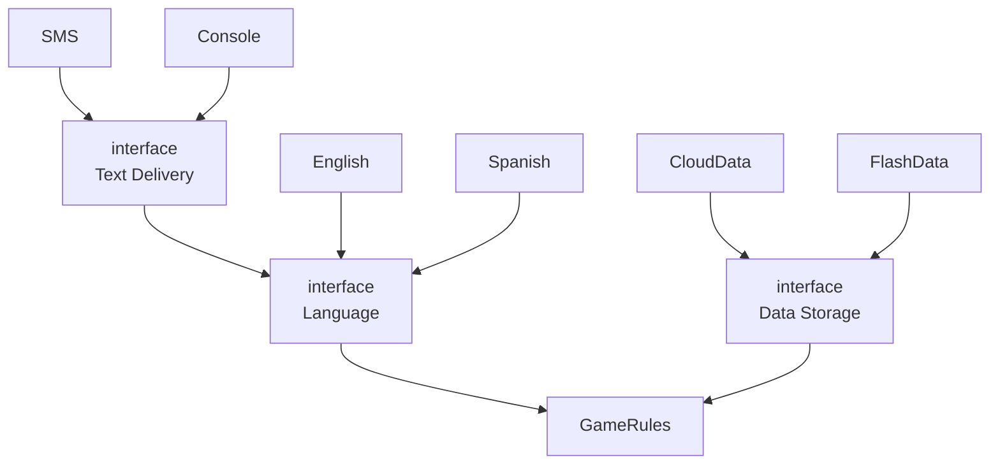
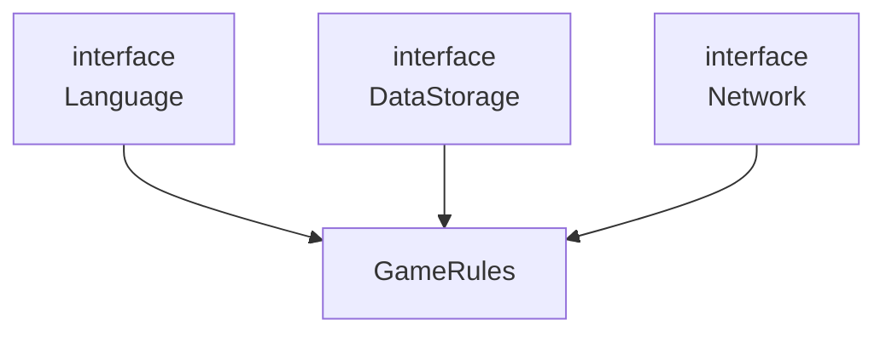

# 25장 계층과 경계

시스템이 세가지 컴포넌트(UI, 비즈니스 로직, DB)로만 구성된다고 생각하기 쉽지만, 간단한 시스템이 아닌 대다수는 훨씬 더 많다.

## 옴퍼스 사냥 게임

- 옴퍼스 사냥 게임:  플레이어가 단순한 명령어(예: GO EAST, SHOOT WEST)를 입력해 동굴 시스템을 탐험하며 움퍼스를 사냥하는 게임
- 가정: 텍스트 기반 UI는 유지, 게임 규칙과 UI를 분리해 다양한 언어로 발매하기

    ```mermaid
    graph LR
    EnglishUI[English UI]
    SpanishUI[Spanish UI]
    GameRules[Game Rules]
    
        EnglishUI --> GameRules
        SpanishUI --> GameRules
    ```
    - 게임 규칙: 언어 독립적인 API를 사용해 UI 컴포넌트와 통신
    - UI: API를 사람이 이해할 수 있는 언어로 변환
    - 의존성을 적절히 관리하면, 컴포넌트가 어떤 언어를 사용하더라도 게임 규칙을 재사용할 수 있다.

- 가정: 게임의 상태를 영속적인 저장소에 저장하고싶은데, 게임 규칙은 저장되는 위치등을 몰랐으면 한다면
  ```mermaid
  graph TD
  EnglishUI[English UI]
  SpanishUI[Spanish UI]
  GameRules[Game Rules]
  FlashData[Flash Data]
  CloudData[Cloud Data]

  EnglishUI --> GameRules
  SpanishUI --> GameRules
  FlashData --> GameRules 
  CloudData --> GameRules 
  ```
    - 게임 규칙이 다양한 종류의 저장소에 대해 알지 않아도 되도록, 의존성 방향이 적절한 방향을 가르키게 만들어야함


## 클린 아키텍처?

이 예제의 중요한 아키텍처 경계를 정말로 모두 발견했을까?

이 변경축에 의해 정의되는 아키텍처 경계가 잠재되어 있을 수도 있어, 언어를 통신 매커니즘으로부터 격리하는 API를 생성해야할 수도 있다.


- 인터페이스로 표시된 것은 추상 컴포넌트를 가리키며, 하위의 컴포넌트들이 구현한다.
- `GameRules`는 `Language API`를 이용해 하위 컴포넌트들과 통신하며, `TextDelivery API`를 이용해 통신한다.
- API는 구현하는 쪽이 아닌, 사용하는 쪽에 정의되고 사용된다.

- 단순화된 다이어그램:  모든 화살표가 한방향인 `GameRules`방향으로만 향한다.

    ```mermaid
    graph TD
        Language[interface<br>Language] --> GameRules
        DataStorage[interface<br>DataStorage] --> GameRules
        TextDelivery[interface<br>TextDelivery] --> Language
    ```

  - `GameRules`: 최상위 수준의 정책을 가지는 컴포넌트이므로 맞는 배치
  - 정보가 흐르는 방향 관점으로 생각하기
    - 정보가 흐르는 방향
      - 모든 입력은 사용자로부터 전달 받아 `TextDelivery` 컴포넌트로 전달
      - 이 내용은 `Language`를 거쳐 `GameRules`에 적합한 명령어로 번역
      - `GameRules`는 사용자 입력을 처리하고, `DataStorage`에 적절한 데이터를 보냄, Language로 출력을 보냄
      - `Language`는 적절한 언어로 변환하며 `TextDelivery`를 통해 사용자에게 전달됨
    - 두 개의 흐름을 효과적으로 분리
        - 사용자와의 통신 흐름
        - 데이터의 영속성 관리
        - 두 흐름은 `GameRules`에서 서로 만나며, 여기서 최종적인 처리가 이루어짐

## 흐름 횡단하기

여러 유저와 함께 사용할 수 있다고 가정하면, 데이터 흐름은 아까와 같이 두가지가 아니라 더 여러가지가 된다.
네트워크(Network) 컴포넌트를 추가해, 세 개의 흐름으로 분리되며 모두 `GameRules`가 제어함



따라서, 복잡해질수록 더욱 많은 흐름으로 분리될 것이다.

## 흐름 분리하기

이쯤되면, 모든 흐름이 결국에는 상단의 단일 컴포넌트에서 서로 만난다고 생각할 수도 있지만 현실은 훨씬 복잡하다.

옴퍼스 사냥 게임에서 예를 들자면, 게임 규칙의 일부인 지도와 관련된 메커니즘(e.g. 각 동굴에 어떤 물체가 위치할지, 동굴에서 동굴로 이동하는 방법 등)을 알고 있다.
그리고 그 외에도 더 높은 수준의 정책(e.g. 플레이어의 생명력, 특정 사건을 해결하는 데 드는 비용과 얻는 소득 등)이 있다.

- 저수준 메커니즘과 정책: 고수준 정책에게 사건이 발생했음을 알림
- 고수준 매커니즘과 정책: 게임의 결과, 플레이어의 상태 등을 관리함

---

이것이 아키텍처의 경계일까? 이 예제를 좀 더 흥미롭게 만들어서 MSA까지 추가해보자.

- MSA
    ```mermaid
    graph TD
        PlayerMgmtImpl["Player Mgt.<br>Imp."]
        PlayerMgmtProxy["Player Mgt.<br>Proxy."]
        PlayerManagement["interface<br>Player Management"]
        MoveManagement["Move Management"]
        Network1["interface<br>Network"]
        Network2["interface<br>Network"]
        Language["interface<br>Language"]
        DataStorage["interface<br>Data Storage"]
    
        PlayerMgmtImpl --> PlayerManagement
        PlayerMgmtProxy --> PlayerManagement
        Network1 --> PlayerMgmtImpl
        Network2 --> PlayerMgmtProxy
        PlayerManagement --> MoveManagement
        Language --> MoveManagement
        DataStorage --> MoveManagement
    ```
    - 추가된 시나리오
      - 대규모 플레이어가 동시에 플레이
      - `MoveManagement`는 컴퓨터에서 직접 처리, `PlayerManagement`는 서버에서 처리
      - `PlayerManagement`는 접속된 모든 `MoveManagement`에 MSA API 를 제공
    - 이전보다 훨씬 복잡하지만, `MoveManagement`와 `PlayerManagement` 사이에는 완벽한 형태의 아키텍처 경계가 존재

## 결론

> 이 예제를 가져온 이유는 아키텍처 경계가 어디에나 존재한다는 사실을 보여주기 위함이다.
> 아키텍트로서 우리는 아키텍처의 경계가 언제 필요한지를 신중하게 파악해내야 한다.
> 또한 이러한 경계를 제대로 구현하려면 비용이 많이 든다는 사실도 인지하고 있어야한다.

- 오버 엔지니어링이 언더 엔지니어링보다 나쁠 때가 훨씬 많기 때문에, YAGNI 를 지켜야한다.
- -> 항상 현명하게 추측해야하고, 완벽하게 구분할 경계/ 부분적으로 구현할 경계 가 무엇인지 어떻게 할지를 고민해야한다.
- 이 고민은 한번에 끝나는것이 아니라, 시스템이 발전함에 따라 주의를 기울여 계속해서 관찰해야한다.
    - 지켜보다가 조짐이 보이면, 경계를 구현하는 데 드는 비용과 이를 무시했을 때 감수해야 할 비용을 비교해야 한다.
- 우리의 목표는 경계의 구현 비용이 그걸 무시해서 생기는 비용보다 적어지는 바로 그 변곡점에서 경계를 구현하는 것!
    - 이를 위해서는 빈틈없이 지켜봐야 한다.
