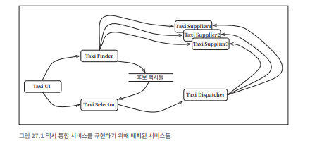
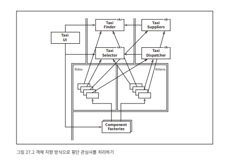
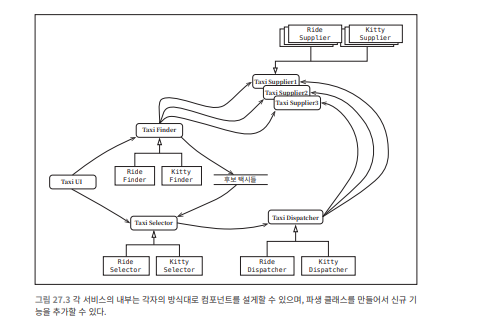
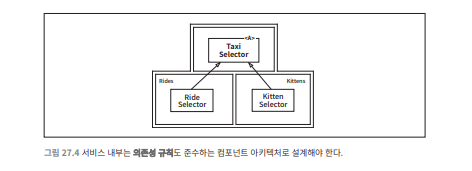

# 27장 ‘크고 작은 모든’ 서비스들

서비스 지향 '아키텍처'와 마이크로서비스 '아키텍처'가 인기를 끌고 있는 이유는 다음과 같다.

- 서비스를 사용하면 상호 결합이 철저하게 분리되는 것처럼 보인다. 이는 일부만 맞는 말이다.
- 서비스를 사용하면 개발과 배포 독립성을 지원하는 것처럼 보인다. 이 역시도 일부만 맞는 말이다.

## 서비스 아키텍처?

서비스를 사용한다고 해서 그것이 곧 아키텍처를 의미하는 것은 아니다.

**시스템의 아키텍처는 ‘의존성 규칙’을 준수하며 고수준 정책을 저수준 세부사항으로부터 분리하는 경계에 의해 정의된다.**

단순히 애플리케이션의 행위를 나누어놓은 서비스는 그저 값비싼 함수 호출에 불과하며, 아키텍처적으로 꼭 중요하다고 볼 수 없다.

**서비스와 아키텍처**

- 모든 서비스가 반드시 아키텍처 관점에서 중요할 필요는 없다.
- 기능을 프로세스나 플랫폼에 독립적이게 만들기 위해 서비스화하면, 의존성 규칙 준수 여부와 관계없이 유용할 수 있다.
- 하지만 서비스 자체가 아키텍처를 정의하지는 않는다.

**함수 구성 형태와 비교**

- 모놀리식 시스템이나 컴포넌트 기반 시스템에서도 아키텍처를 결정짓는 요소는 아키텍처 경계를 넘나드는 함수 호출과 의존성 방향이다.
- 나머지 많은 함수들은 단순히 행위를 분리할 뿐, 아키텍처적으로는 전혀 중요하지 않다.
- 서비스도 마찬가지로, 단순히 프로세스나 플랫폼 경계를 가로지르는 함수 호출이다.

## 서비스의 이점?

### 결합 분리의 오류

서비스 아키텍처의 장점 중 하나는 서비스 간 결합이 확실히 분리된다는 점이다.

각 서비스가 서로 다른 프로세스(혹은 심지어 다른 프로세서)에서 실행되며, 서로의 변수를 직접 접근할 수 없고, 명확한 인터페이스를 통해서만 통신하기 때문

그러나 

- 서비스는 개별 변수 수준에서만 결합이 분리될 뿐, 프로세스 내 공유 자원이나 네트워크 상의 공유 상태 때문에 여전히 결합될 수 있다.
    
    예: 서비스 간 데이터를 교환하는 레코드에 새로운 필드를 추가
    
    - 이 필드를 사용하는 모든 서비스는 변경이 필요
    - 해당 필드를 해석하는 방식 또한 모든 서비스가 사전에 완벽하게 합의해야 함
    
    이로 인해 서비스들은 데이터 레코드에 강하게 결합되고, 결과적으로 서비스 간 간접적 결합이 생겨버린다.
    

서비스 인터페이스가 함수보다 더 엄밀하거나 더 잘 정의되는 건 아니기 때문에 인터페이스의 이점도 함수의 경우와 다르지 않다. 

### 개발 및 배포 독립성의 오류

서비스 아키텍처를 도입하면 각 서비스가 전담팀에 의해 소유 및 운영될 수 있다는 점이 큰 장점이다.

- 데브옵스(DevOps) 전략을 실현
- 전담팀이 서비스를 작성·유지보수·운영까지 책임
- 대규모 시스템을 수십~수천 개의 독립 배포 가능한 서비스로 나눌 수 있다고 기대한다.

또한 시스템의 개발과 운영을 독립된 팀 단위로 분할할 수 있다고 생각한다.

하지만 이 것 또한 일부일 뿐

1. 대규모 엔터프라이즈 시스템은 반드시 서비스 아키텍처로만 확장 가능한 것이 아니다.
    - 모노리식 시스템
    - 컴포넌트 기반 시스템
    
    과거 사례를 보면 위 두 방식도 충분히 확장 가능한 시스템으로 발전할 수 있었다.
    
2. 서비스라고 해서 항상 독립적으로 개발·배포·운영할 수 있는 것은 아니다.
    - 서비스들이 데이터나 행위(비즈니스 로직)에서 결합된다면, 각 서비스의 배포와 개발은 그 결합 정도에 맞추어 조정해야한다.

## 야옹이 문제

**기존 택시 시스템**

- 시스템은 TaxiUI, TaxiFinder, TaxiSelector, TaxiDispatcher, TaxiSupplier 등의 여러 마이크로서비스로 구성
- 각 서비스는 독립적인 팀에 의해 개발·운영되며, 고객의 승차 요청에서 택시 배차까지 담당
- 설계 당시에는 기능 분해를 잘했다고 생각했을 것이다.

**야옹이 서비스 추가**

마케팅팀에서 "고양이 배달 서비스"라는 새로운 기능을 요구

- 야옹이를 태울 승차 지점 관리, 택시 선택 로직 수정, 고양이 알러지 여부 고려, 최근 야옹이 배달 이력 관리 등 새로운 정책이 추가된다.
- 특정 택시 업체만 참여할 수 있는 제한 조건도 생긴다.

**문제점**

새로운 기능을 추가하려면 **모든 마이크로서비스를 변경해야 한다.**

- TaxiUI: 고양이 배달 요청 UI 추가
- TaxiFinder: 야옹이 가능 택시 후보 필터링
- TaxiSelector: 알러지 여부와 최근 이력 기반으로 택시 선택
- TaxiDispatcher: 새로운 배차 로직 반영
- TaxiSupplier: 업체별 정책 반영

👉서비스가 독립적이지 않다.

팀별로 관리하는 서비스를 모두 동시에 조정해야 하므로 개발·배포의 독립성이 무너진다.

횡단 관심사(Cross-Cutting Concern)

"새로운 기능이 기존 서비스들의 경계를 가로질러 들어올 때" 모든 소프트웨어는 이 문제에 직면한다.

## 객체가 구출하다

객체 지향적 접근이라면? SOLID, 다형적으로 해결.

SOLID 원칙을 잘 적용하면, 새로운 기능이 기존 서비스의 코드를 대거 수정하지 않고도 확장할 수 있다. 

1. 기존 서비스의 로직을 추상 기반 클래스로 캡슐화한다.
2. 새로운 기능은 다형성을 통해 기존 구조를 확장한다.
3. 템플릿 메서드나 전략 패턴을 활용해 새 기능을 기존 아키텍처와 연결한다.

- 기존 서비스 로직이 `TaxiFinder`, `TaxiSelector`, `TaxiDispatcher` 등 기반 클래스로 흡수된다.
- 새로운 Rides(배차) 컴포넌트와 Kittens(야옹이) 컴포넌트가 추가되며, 기존 로직의 확장 포인트를 오버라이드한다.
- 야옹이 기능은 새로운 모듈(jar, gem, DLL 등)로 패키징되어 런타임에 동적 로드한다.
- 장점
    - UI는 여전히 변경해야 하지만, 그 외는 변경할 필요 없다.
    - 야옹이 기능은 결합이 분리되며, 독립적으로 개발하여 배포할 수 있다.
    - 원칙 준수
        - OCP: 기존 코드를 수정하지 않고 기능 확장 가능.
        - DIP: 의존성 규칙 준수

## 컴포넌트 기반 서비스

서비스 아키텍처에도 OCP(개방-폐쇄 원칙)를 적용할 수 있다.

서비스 내부를 SOLID 원칙에 따라 컴포넌트화하면, 기존 서비스를 손대지 않고도 새로운 기능을 플러그인처럼 추가할 수 있다.

**예시(자바)**

- 서비스를 하나 이상의 jar 파일에 포함되는 추상 클래스들의 집합이라고 생각한다.
- 새로운 기능 추가 또는 확장은 새로운 jar로 만든다.
    - 새로운 jar 파일을 구성하는 클래스들은 기존 jar 파일에 정의된 추상 클래스들을 확장해서 만든다.
- 새로운 기능 배포는 서비스를 로드하는 경로에 단순히 새로운 jar 파일을 추가한다.

서비스의 핵심 코드 변경 없이 기능을 확장할 수 있으므로 OCP를 충족한다.

- 서비스 간의 배치는 기존 마이크로서비스 아키텍처와 동일
- 하지만 각 서비스 내부는 컴포넌트화되어 있어 확장이 유연
    - 예를 들어 기존 `TaxiSelector` 서비스는 그대로 두고, `KittensSelector`라는 파생 클래스를 추가하는 식으로 새로운 기능을 붙일 수 있다.

## 횡단 관심사

**서비스가 아키텍처 경계 자체가 아니다**

**아키텍처의 진짜 경계는 서비스 내부의 컴포넌트 수준에서 정의된다.**

횡단 관심사를 처리하려면 서비스 내부는 의존성 규칙도 준수하는 컴포넌트 아키텍처로 설계해야 한다.

## 결론

서비스 자체가 아키텍처를 정의하지는 않는다.  

시스템의 아키텍처는 시스템 내부에 그어진 경계와 경계를 넘나드는 의존성에 의해 결정된다.

서비스는 

하나의 단일 컴포넌트(아키텍처 경계가 없는 상태)로 존재할 수도 있고, 

**여러 아키텍처 경계로 잘게 나뉜 컴포넌트 집합**으로 존재할 수도 있다.

드물게는 클라이언트와 서비스가 강하게 결합되어 아키텍처적으로 아무런 의미가 없을 때도 있다.