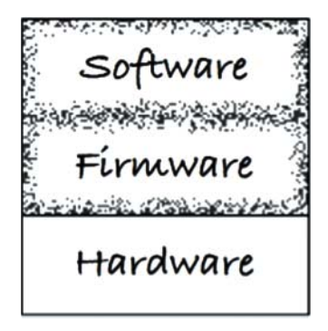

# 29장 클린 임베디드 아키텍처

더그 슈미트는 얼마전 블로그에서 이러한 주장을 했다.

_"소프트웨어는 닳지 않지만, 펌웨어와 하드웨어는 낡아 가므로 결국 소프트웨어도 수정해야한다"_

하지만 실제로 임베디드 시스템을 개발해보면, 하드웨어도 계속해서 발전하고 개선된다. 그와 동시에 소프트웨어 또한 새로운 기능들이 추가되며 복잡도가 계속해서 증가한다. 그래서 더그의 주장에 다음과 같이 덧붙일 수 있다.

_소프트웨어는 닳지 않지만, 펌웨어와 하드웨어에 대한 의존성을 관리하지 않으면 안으로부터 파괴될 수 있다._

이처럼 오래 살아남을 수 있던 임베디드 소프트웨어가 하드웨어 의존성 때문에 오염되어 일찍 죽는 경우가 드물지 않다.

---

저장되는 위치는 펌웨어를 정의하지는 않는다. 이보다는 **무엇에 의존하는지, 그리고 하드웨어 발전에 맞춰 수정하기 얼마나 어려운지에 따라 정의**된다. 하드웨어는 계속해서 발전하기에 임베디드 코드를 구조화 할 수 있어야 한다. 

펌웨어에 대한 정의는 이러한 것들이 있다. 

- 펌웨어는 ROM, EPROM 혹은 플래시 메모리 같은 비휘발성 메모리에 유지된다.
- 펌웨어는 하드웨어 장치에 프로그래밍된 소프트웨어 프로그램 혹은 명령어 집합이다.
- 펌웨어는 개별 하드웨어에 내장되는 소프트웨어다.
- 펌웨어는 읽기 전용 메모리에 쓰여진 소프트웨어(프로그램이거나 데이터)다.

---
**우리가 진정 원하는 것은 펌웨어는 더 적게 만들고, 소프트웨어는 더 많이 만드는 것이다**. 만일 당신도 코드에 SQL을 심어 놓거나, 안드로이드 앱 개발자라면 안드로이드 API로부터 업무 로직을 분리 하지 않는 다면, 이것은 결국 펌웨어를 작성하는 셈이다.

**결과적으로 펌웨어를 수없이 양산하는 일을 멈추고, 코드에게 유효 수명을 길게 늘릴 수 있는 기회를 주어야 한다.**

## 앱-티튜드 테스트

왜 잠재적인 임베디드 소프트웨어는 그렇게도 많이 펌웨어로 변하는가? 

그 이유는 **임베디드 코드가 동작하게 만드는 데 대부분의 노력을 집중**하고, 오랫동안 유용하게 남도록 **구조화하는 데는 그리 신경 쓰지 않기 때문**으로 보인다.

켄트 백은 소프트웨어를 구축하는 세 가지 활동을 다음과 같이 기술했다.

- **"먼저 동작하게 만들어라."** 소프트웨어가 동작하지 않는다면 사업은 망한다.
- **"그리고 올바르게 만들어라."** 코드를 리팩터링해서 당신을 포함한 나머지 사람들이 이해할 수 있게 만들고, 요구가 변경되거나 요구를 더 잘 이해하게 되었을 때 코드를 개선할 수 있게 만들어라.
- **"그리고 빠르게 만들어라."** 코드를 리팩터링해서 '요구되는' 성능을 만족 시켜라.

현장에서 지켜본 수많은 임베디드 소프트웨어는 "동작하게 하라", 혹은 "빠르게 만들어라" 라는 목표에만 집착하는 것 같다. 사실 이러한 문제들은 임베디드가 아니라 대다수의 앱들에도 적용되기도한다.

앱이 동작하도록 만드는 것을 저자는 개발자용 _앱-티튜드 테스트_ 라고 부른다. 프로그래밍에는 단순히 앱이 동작하도록 만드는 것보다 중요한 것이 훨씬 많다.

다음은 앱-티튜트 테스트를 통과하기 위해 작성된 코드의 예로, 작은 임베디드 시스템의 한 파일에서 찾은 함수들이다.

```
ISR(TIMER1_vect) { ... }
ISR(INT2_vect) { ... }
void btn_Handler(void) { ... }
float calc_RPM(void) { ... }
static char Read_RawData(void) { ... }
void Do_Average(void) { ... }
void Get_Next_Measurement(void) { ... }
void Zero_Sensor_1(void) { ... }
void Zero_Sensor_2(void) { ... }
void Dev_Control(char Activation) { ... }
char Load_FLASH_Setup(void) { ... }
void Save_FLASH_Setup(void) { ... }
void Store_DataSet(void) { ... }
float bytes2float(char bytes[4]) { ... }
void Recall_DataSet(void) { ... }
void Sensor_init(void) { ... }
void uC_Sleep(void) { ... }
```

이 함수 목록은 소스 파일에서 발견한 순서 그대로이다. 이제 이 함수를 분류해 관련된 것 끼리 묶을 것이다.

- 도메인 로직을 포함하는 함수들
```
float calc_RPM(void) { ... }
void Do_Average(void) { ... }
void Get_Next_Measurement(void) { ... }
void Zero_Sensor_1(void) { ... }
void Zero_Sensor_2(void) { ... }
```

- 하드웨어 플랫폼을 설정하는 함수들
```
ISR(TIMER1_vect) { ... }*
ISR(INT2_vect) { ... }
void uC_Sleep(void) { ... }
```

- 전원 버튼에 반응하는 함수들
```
void btn_Handler(void) { ... }
void Dev_Control(char Activation) { ... }
```

- 하드웨어로부터 A/D 입력을 읽어 들이는 함수
```
static char Read_RawData(void) { ... }
```

- 영구 저장소에 값을 저장하는 함수들
```
char Load_FLASH_Setup(void) { ... }
void Save_FLASH_Setup(void) { ... }
void Store_DataSet(void) { ... }
float bytes2float(char bytes[4]) { ... }
void Recall_DataSet(void) { ... }
```

- 함수의 이름과 함수가 하는 일이 다른 함수
```
void Sensor_init(void) { ... }
```

이 코드는 **특정 임베디드 장치에서만 테스트할 수 있음을 암시하는 파일 구조를 포함**하고 있었다. 코드를 특정 툴 체인과 마이크로프로세서에 구속해 버리는 '확장된' C 언어 구조를 사용했기 때문이다. 이 코드는 **유효 수명을 길게 유지할 길이 없다**.

이 애플리케이션은 동작하며, 엔지니어는 앱-티튜드 테스트를 통과했다. 하지만 이 애플리케이션이 클린 임베디드 아키텍처를 가진다고 말하기는 어렵다.

## 타깃-하드웨어 병목현상

임베디드 소프트웨어 개발자들은 임베디드가 아니었다면 다루지 않아도 될 특수한 관심사를 많이 가지고 있다.

예를 들면 제한된 메모리 공간, 실시간성 제약과 처리완료 시간, 제한된 입출력, 특이한 사용자 인터페이스, 여러 센서와 실제 세상과의 상호작용 등이다.

이처럼 임베디드가 **지닌 특수한 문제 중 하나는 타깃-하드웨어 병목현상**이다. 임베디드 코드가 클린 아키텍처 원칙과 실천법을 따르지 않고 작성된다면, 대개의 경우 테스트할 수 있는 환경이 해당 특정 타깃으로 국한 될것이다. 그리고 그 타깃이 테스트가 가능한 유일한 장소라면 타깃-하드웨어 병목현상이 발생하여 진척이 느려질 것이다.

### 클린 임베디드 아키텍처는 테스트하기 쉬운 임베디드 아키텍처다

몇 가지 아키텍처 원칙을 임베디드 소프트웨어와 펌웨어에 적용해 타깃-하드웨어 병목 현상을 줄이는 방법을 살펴보자,

**계층**

계층에는 여러가지가 있다. 먼 그림 29.1은 스프트웨어, 펌웨어, 하드웨어의 위계를 나타낸다. 


_그림 29.1 세 개의 계층_

이 상태라면 하드웨어 관련 정보가 코드를 전부 오염시킬 수 있는 상태가 된다. 따라서 하드웨어는 시스템의 나머지 부분으로부터 반드시 분리해야한다.

아래의 그림 29.2를 보자. **소트웨어와 펌웨어가 서로 섞이는 안티 패턴을 나타낸다**. 이러한 안티 패턴을 보이는 코드는 **변경하기 어렵고, 변경하는 일 자체에 리스크가 수반된다.**


**하드웨어는 세부사항이다**

그림 29.4에서 보듯이 소프트웨어와 펌웨어 사이의 경계는 코드와 하드웨어사이의 경계와 달리 **구분하기 힘들다**.



_그림 29.4 소프트웨어와 펌웨어 사이의 경계는 코드와 하드웨어 사이의 경계보다는 조금 흐릿하다._

임베디드 소프트웨어 개발자가 해야 할 일 하나는 이 경계를 분명하게 만드는 것이다.

**이 소프트웨어와 펌웨어 사이의 경계는 하드웨어 추상 계층(HAL) 이라고 부른다.**


HAL 은 새로운 개념 이 아니라, 윈도우 이전부터 존재하던 개념이다. 예로, 펌웨어에서 바이트를 플래시 메모리에 저장할 수 있다 치자. 반대로 애플리케이션에서는 이름/값이 쌍으로 된 데이터를 저장해야한다. 여기서 **소프트웨어는 이름/값 쌍으로 된 데이터가 저장된다는 사실이 중요하지, 플래시 메모리에 저장할지 하드디스크에 저장할지, 클라우드에 저장되는지 전혀 개의치 않는다.**

결론적으로 이러한 구체적인 사항은 소프트웨어로 부터 숨겨야 하는 것이다.

### HAL 사용자에게 하드웨어 세부사항을 드러내지 말라

클린 임베디드 아키텍처로 소프트웨어가 설계되었다면 타깃 하드웨어 상관없이 테스트가 가능하다. HAL 또한 제대로 만들었따면 타깃 상관없이 테스트할 수 있는 경계층을 제공한다.

**프로세서는 세부사항이다**

임베디드 앱이 특수한 툴 체인을 사용하는 경우가 있는데, 흔히 이런 툴 체인의 컴파일러는 C 언어를 제멋대로 변경해 업체의 **프로세서 기능에 접근할 수 있는 새로운 키워드를 만들어낸다**. 하지만 이 시점에서 코드는 C처럼 보이지만 이미 C가아니다.

그 이유는 프로세서 제작 업체가 제공하는 C 컴파일러는 **그 업체의 프로세서 레지스터, 입출력 포트, 클럭 타이머 등 프로세서 관련 나머지 함수들에 직접 접근**하도록 해준다. 이 대상들에 접근하는 순간 그 코드는 C가 아니다. 그 이유는 **해당 업체의 프로세서가 아닌 다른 프로세서에서는 컴파일되지 않을 것이기 때문**이다.

클린 임베디드 아키텍처라면 이들 장치 접근 레지스터를 직접 사용하는 코드는 소수의, 순전히 펌웨어로만 한정시켜야 한다. 이러한 마이크로 컨트롤러를 사용할 때, 펌웨어가 저수준 함수들을 프로세서 추상화 계층(PAL)의 형태로 격리시켜줄 수 있다. **PAL상위에 위치하는 펌웨어는 타깃-하드웨어 상관없이 테스트할수 있게된다**.

**운영체제는 세부사항이다**

HAL은 필수적이다. 하지만 HAL만으로 충분한가? 임베디드 시스템에서 **실시간 운영체제**를 사용하거나, **임베디드 버전의 리눅스/윈도우를 사용**한다면?

작성한 코드의 수명을 늘리려면, **무조건 운영체제를 세부사항으로 취급하고 운영체제에 의존하는 일을 막아야한다**.

소프트웨어는 운영체제를 통해 운영 환경이 제공하는 서비스에 접근한다. **OS는 펌웨어로 부터 소프트웨어를 분리하는 계층이다.**

다음 그림은 앞서봤던 계층에 OS를 추가한 것이다.


OS를 직접 사용해서는 안된다. 이유는 프로세서와 크게 다르지 않다. 만약 해당 업체를 다른 기업이 인수해 새로운 OS를 적용해야한다면?

클린 임베디드 아키텍처는 운영체제 추상화 계층(OSAL)을 통해 소프트웨어를 운영체제로부터 격리 시킨다.


**OSAL 구현은 함수 일므을 바꿔주는 정도로 단순할 수 도있다.**

소프트웨어가 OS에 직접 의존하는 대신 OSAL에 의존한다면, 이식 작업의 대부분은 기존 OSAL과 호환되도록 새로은 OSAL을 작성하는 데 소요될 것이다. 이제 코드 비대화 문제가 염려되기 시작할 수 있다. 하지만 그다지 큰 비용을 초래하지는 않는다. **OSAL을 정의하는 일은 결국 애플리케이션에서도 공통 구조를 가지도록 힘쓰는 일이기 때문이다.**

### 인터페이스를 통하고 대체 가능성을 높이는 방향으로 프로그래밍하라

HAL, OSAL 뿐 아니라, 모든 주요계층(소프트웨어, OS 펌웨어, 하드웨어) 내부에는 각 계층을 분리해야한다.

이들 원칙은 관심사를 분리시키고, 인터페이스를 활용하며, 대체 가능성을 높이는 방향으로 프로그래밍 하도록 유도한다.

계층형 아키텍처는 인터페이스를 통해 프로그래밍하자는 발상을 기반으로 한다. **모듈들이 서로 인터페이스를 통해 상호작용한다면 특정 서비스 제공자를 다른 제공자로 대체할 수 있다.**

클린 임베디드 아키텍처라면 모듈들이 인터페이스를 통해 상호작용하기 때문에 각각의 계층 내부에서 태스트가 가능하다. 각 인터페이스는 타깃(하드웨어, OS 등)과 상관없이 별개로 테스트 할 수 있도록 해주는 경계층 또는 대체 지점을 제공한다.

### DRY 원칙: 조건부 컴파일 지시자를 반복하지 말라

임베디드 시스템의 경우 타깃-하드웨어의 유형을 식별하는 조건부 컴파일을 반복해서 사용할 때가 많다. 이는 코드를 반복하는 행위로, "반복하지말라(DRY)" 는 원칙을 위배한다. 그럴때 HAL을 사용할 수 있다. HAL뒤에서 하드웨어의 유형은 세부사항이 되며, **가려진다.** 이 **HAL이 조건부 대신 인터페이스를 제공한다면 소프트웨어와 하드웨어 관계없이 연결이 가능해진다.**
