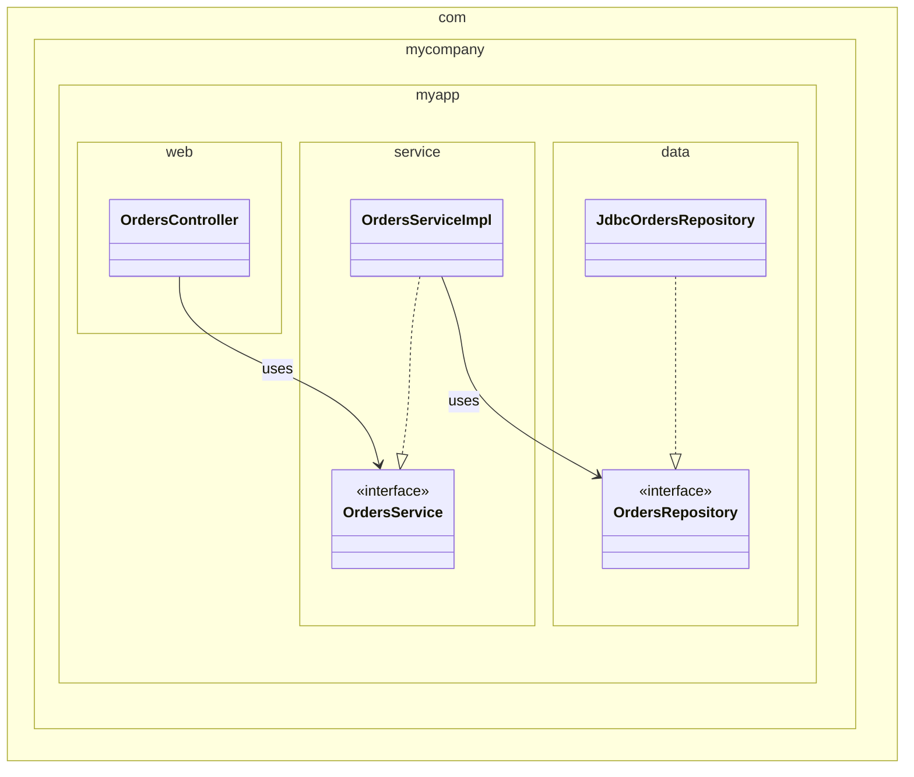
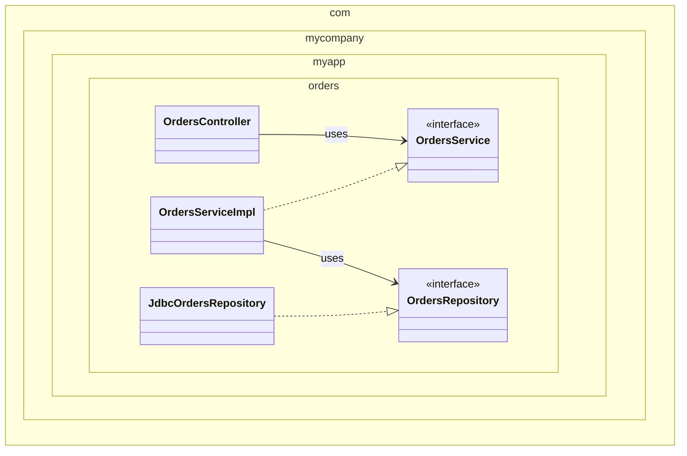
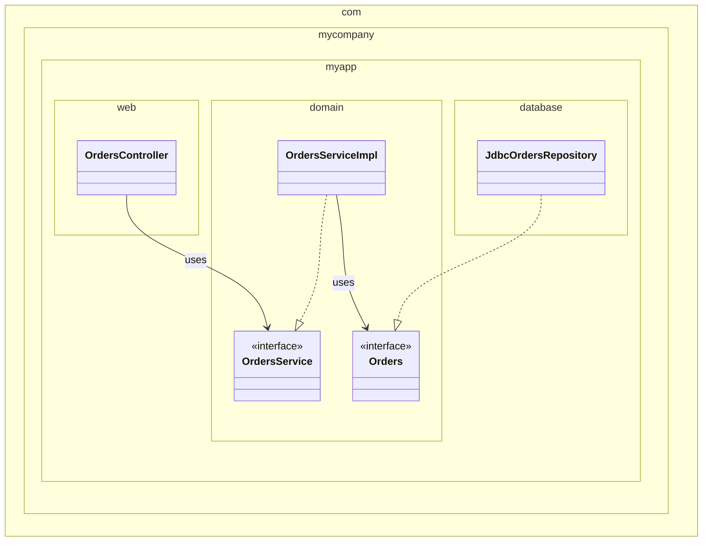
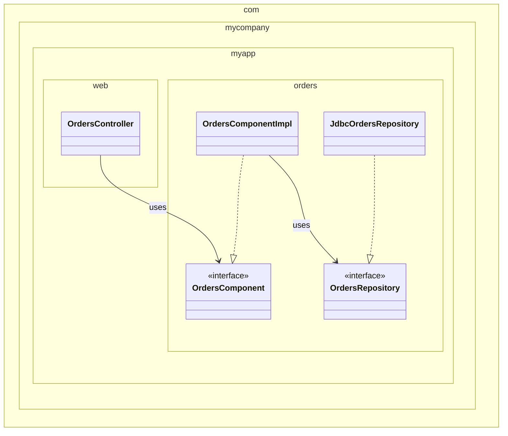
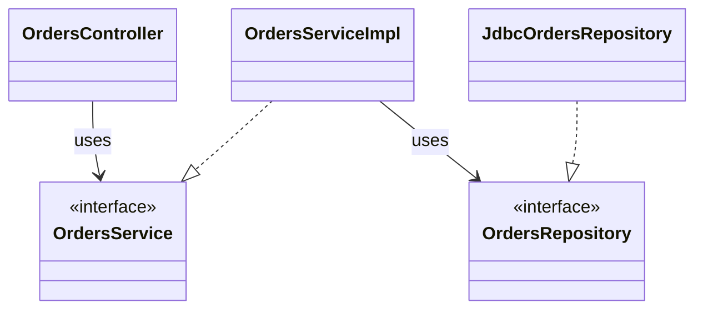
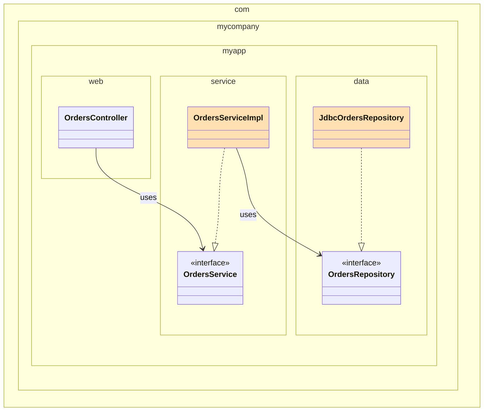
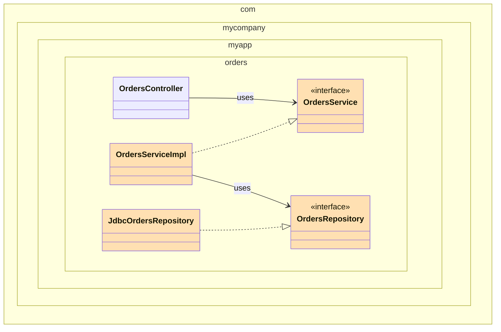
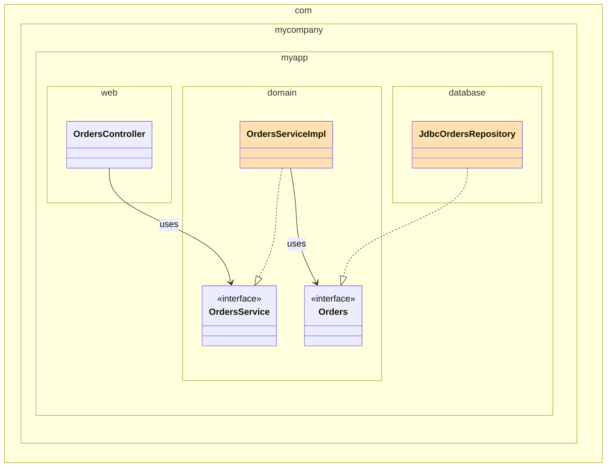
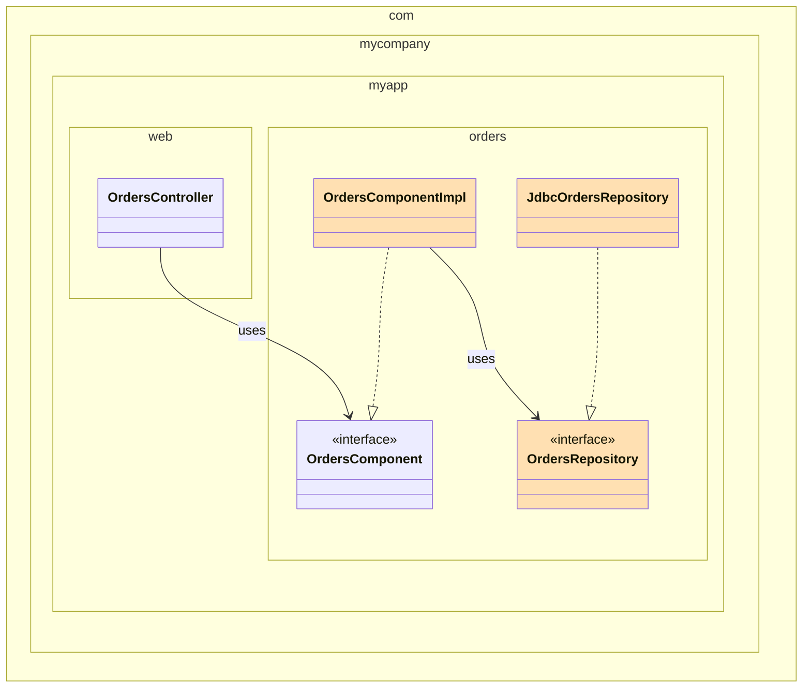

# 34장 빠져 있는 장

**온라인 서점에서 고객이 주문 상태를 조회하는 기능 구현**

## 계층 기반 패키지

- 전통적인 수평 계층형 아키텍처
- 기술적인 관점에서 해당 코드가 하는 일에 기반해 그 코드를 분할
    - 웹, 서비스, 데이터 등
    - 각 계층은 유사한 종류의 것들을 묶는 도구로 사용
- 자바에서는 보통 패키지 구조로 구현
- '엄격한 계층형 아키텍처'의 경우 계층은 반드시 바로 아래 계층에만 의존



1. **web 패키지**
    - `OrdersController`: 웹 요청을 처리하는 컨트롤러
2. **service 패키지**
    - `OrdersService`: 주문 서비스 인터페이스. 주문 관련 '업무 규칙'을 정의.
    - `OrdersServiceImpl`: 주문 서비스 구현체
3. **data 패키지**
    - `OrdersRepository`: DB 접근 인터페이스
    - `JdbcOrdersRepository`: JDBC 기반의 구현체

➡ 각 계층은 바로 아래 계층에만 의존하는 구조 (아래로 향하는 단방향 의존성)

### **장점**

- 초반에는 유용한 구조
    - 초기 프로젝트에서 빠른 구성 가능
- 단순함
    - 복잡한 설계 없이 빠르게 작동하는 구조 만들 수 있음

### 단점

1. 확장에 취약
    - 시스템이 커지면 web/service/data 3개 층만으로는 분리가 부족
    - 결국 더 잘게 쪼개고 모듈화할 필요성이 생김

2. 업무 도메인을 반영하지 않는다

- 도메인이 다른 두 시스템도 구조가 같다: `Controller → Service → Repository`

## 기능 기반 패키지

- 기능/도메인 개념에 따라 수직적으로 분리
- 하나의 패키지 안에 컨트롤러, 서비스, 리포지터리 등 모든 계층이 함께 들어감
- 패키지 이름은 **업무 개념을 반영**하여 지음 (예: `orders`)



모든 클래스는 `com.mycompany.myapp.orders` 패키지 안에 위치

- OrdersController: 웹 요청 처리
- OrdersService, OrdersServiceImpl: 도메인 로직
- OrdersRepository, JdbcOrdersRepository: DB 접근

➡ 구조적으로는 계층형과 같지만, 패키지 구성이 기능 중심으로 바뀜.

### **장점**

1. 도메인을 드러낸다
    - 이제 패키지를 보면 `orders`, `payments`, `products` 같은 개념이 보임.
    - 코드의 상위 구조만 봐도 시스템이 무슨 일을 하는지 알 수 있다.
2. 변경에 유리하다
    - 예: ‘주문 조회하기’ 기능을 수정할 때 관련된 모든 코드가 `orders` 패키지 안에 있음.
    - 수정 범위를 파악하기 쉬움.

하지만 두 접근법은 모두 차선책이다.

## 포트와 어댑터

- 기술적인 세부사항(UI, DB, 프레임워크 등) 과 업무 규칙(업무/도메인) 을 명확히 분리
- 유스케이스 중심 구조
    - 내부 (Inside): 도메인
    - 외부 (Outside): 프레젠테이션, DB, 외부 시스템 등


**의존성 방향**

👉 모든 의존성은 **항상 외부에서 내부로 향해야 한다**



### **패키지 구성**

- `com.mycompany.myapp.domain` ← (내부)
    - `OrdersService`, `OrdersServiceImpl`, `Orders`
- `com.mycompany.myapp.web` ← 프레젠테이션 계층 (외부)
    - `OrdersController`
- `com.mycompany.myapp.database` ← 인프라스트럭처 계층 (외부)
    - `JdbcOrdersRepository`

### **의존 관계**

- `OrdersController` → `OrdersService`
- `OrdersServiceImpl` → `Orders`
- `JdbcOrdersRepository` → `Orders`

➡ 모든 의존성은 `domain`을 향해 흐름

### **왜 `OrdersRepository`가 `Orders`로 바뀌었나?**

- 도메인 주도 설계(DDD)의 개념인 유비쿼터스 언어(Ubiquitous Language) 를 따른 것.
- 도메인 내부에선 기술 용어보다 업무 개념을 표현해야 한다.
    - 우리는 “주문 리포지터리”가 아니라, “주문”에 대해 말해야 한다.

## 컴포넌트 기반 패키지

기존 계층형 아키텍처는 깔끔해 보이지만 현실에선 종종 무너짐.

- 예: Controller에서 Repository를 바로 호출
    
    ```mermaid
    classDiagram
    	namespace com.mycompany.myapp.web {
    	    class OrdersController
    	}
    	
    	namespace com.mycompany.myapp.service {
    	    class OrdersService
    	    class OrdersServiceImpl
    	}
    	
    	namespace com.mycompany.myapp.data {
    	    class OrdersRepository
    	    class JdbcOrdersRepository
    	}
    
        <<interface>> OrdersService
        <<interface>> OrdersRepository
    
        OrdersController --> OrdersService : uses
        OrdersServiceImpl --> OrdersRepository : uses
        OrdersServiceImpl ..|> OrdersService
        JdbcOrdersRepository ..|> OrdersRepository
        
    		OrdersController --> JdbcOrdersRepository
    ```
    
    의존성은 아래를 향하지만, 계층을 건너뛸 수 있다. (완화된 계층형 아키텍처)
    
    업무 로직 계층을 우회하는 일은 바람직하지 않다. 
    

**자체적으로 Controller는 절대로 Repository에 직접 접근해서는 안 된다는 원칙을 강제하면?**

- 문제가 생기면 결국 편한 길을 선택한다.
    - 자금 고갈, 납기 압박

**빌드 시 정적 분석 도구를 사용한다면?**

- 위반 시 빌드가 실패하기 때문에 효과가 있지만 주기가 길다.

➡ **그래서 등장한 대안이 바로 ‘컴포넌트 기반 패키지’**



- `orders`라는 **기능 단위 패키지** 내에 모든 책임을 모아둠
- 내부에선 여전히 관심사 분리 가능 (`Component` , `Repository`)

### **컴포넌트**

: 인터페이스로 감싸진 연관된 기능들의 묶음

**특징**

- 큰 단위의 단일 컴포넌트 + 관련된 모든 책임을 하나의 패키지로 묶음 (업무 로직 + 영속성)
- 외부에서는 Component 인터페이스만 사용(내부 구현 캡슐화)
- 마이크로서비스처럼 독립적 모듈화 가능

**장점**

1. 도메인 단위로 코드 조직화
    - 주문 관련 작업은 `OrdersComponent`만 보면 됨
2. 관심사의 분리 유지하면서도 캡슐화
    - Controller → Component → Repository 구조
    - 외부에선 내부 세부구현 모름
3. 아키텍처 원칙을 컴파일 시점에 강제할 수 있음
    - 접근 제한자를 통한 구조 강제 가능 (`private`, `public` 최소화)
    - 구조적 실수 방지에 더 강력함
4. 마이크로서비스로 자연스럽게 확장 가능
    - 기능별로 분리된 컴포넌트는 추후 서비스 단위로 분리하기 쉬움

## 구현 세부사항엔 항상 문제가 있다

어떤 아키텍처 스타일을 따르든 간에, 구현에서 세부사항을 잘못 다루면 그 아키텍처는 무너질 수 있다. 

**대표적인 잘못된 구현 습관: `public` 남용**

- 자바 프로젝트에서 거의 모든 클래스가 `public`으로 선언되는 것을 자주 볼 수 있음
- 이유 없이도 튜토리얼, 책, 샘플 코드에서 무비판적으로 따라 하는 경우 많음
- 결과
    - 캡슐화가 무력화됨
    - 외부에서 내부 구현에 직접 접근 가능
    - 결국, 의존성 역전/분리 원칙 등이 깨짐

## 조직화 vs. 캡슐화

### **public 지시자 과용 문제**



- 모든 타입이 `public`이면, 어떤 아키텍처 접근법을 사용하든 간에 **의존성 방향은 동일**해진다.
    - 구조는 다르지만, 구문적으로는 수평적인 계층 구조에 불과하다.
- 실무에서 이런 코드를 자주 보게 된다.

**자바의 접근 지시자를 적절하게 사용하면**

- 패키지와의 조합으로 타입 접근을 제어할 수 있다.
- 패키지 구조를 통해 어떤 구현은 숨기고 어떤 인터페이스는 외부에 노출할지 조절할 수 있다.

### **제한적인 접근 지시자를 사용한 예시들**

1. **계층 기반 패키지**



- OrdersService, OrdersRepository는 외부에서 사용 →  `public`
- OrdersServiceImpl, JdbcOrdersRepository는 내부 구현이므로 `protected`가능.
- 레이어별로 명확히 구분 가능하지만, 기능 간 응집도는 낮다.

1. **기능 기반 패키지**



- OrdersController만 외부에서 접근 가능 → `public`
- 나머지는 모두 같은 기능 안에서 캡슐화 → `protected`

⚠️ 컨트롤러를 거치지 않으면 접근이 불가능하여, 기능 단위의 경계가 명확해진다.

과도하게 닫히면 재사용성이 떨어질 수 있음

1. **포트와 어댑터**



- 외부에서 사용하는 포트 (OrdersComponent, OrdersRepository)는 `public`
- 구현체 (Impl, JdbcRepository)는 내부 구현으로 숨김 `protected`
    - 의존성 주입을 통해 런타임에서 연결하므로 유연성이 높다.

1. **컴포넌트 기반 패키지**



- 컨트롤러 → 컴포넌트 인터페이스만 `public`
- 나머지는 모두 `protected`, 외부에서 직접 접근 불가능.
- 최소한의 공개 타입만 존재하므로 의존성도 최소화되고, 아키텍처 강제력이 강하다.

## 다른 결합 분리 모드

프로그래밍 언어가 제공하는 방법 외에도 소스 코드 의존성을 분리하는 방법은 있다. 

1. **접근 지시자 외의 캡슐화 수단**

자바는 접근 지시자 외에도, 모듈 시스템을 통해 의존성을 제어할 수 있다.

- OSGi 모듈 프레임워크
- Java 9 모듈 시스템 (JPMS)
    - 모든 타입을 `public`으로 선언해도 일부 타입만을 외부에서 사용할 수 있도록 공표할 수 있다.
    - 외부에 노출될 API만 선택적으로 공개 가능

1. **소스 코드 트리 분리**

소스 트리를 나누면 컴파일 시점에 물리적으로도 의존성 방향을 강제할 수 있다.

예: 포트와 어댑터 아키텍처에서

```
📁 domain      → OrdersService, OrdersServiceImpl, Orders
📁 web         → OrdersController
📁 persistence → JdbcOrdersRepository
```

- web과 persistence 코드는 `domain` 코드에 의존한다.
- `domain` 코드는 web과 persistence에 대해 전혀 알지 못한다.
- 이처럼 소스 트리를 나누면 컴파일 시점에 물리적으로도 의존성 방향을 강제할 수 있다.

이론상으로는  빌드 도구(Maven, Gradle)를 사용를 사용해서 모든 컴포넌트를 독립된 프로젝트/소스 트리로 관리하는 게 이상적이다.

현실에서 소스 코드를 이처럼 나누다 보면 성능, 복잡성, 유지보수 문제가 생기기 때문에 포트와 어댑터 접근법을 적용할 때는 단순히 소스 코드 트리를 두 개로 만든다. 

```
📁 domain   → 내부 (핵심 로직, 포트)
📁 infra    → 외부 (웹, DB 등 어댑터들)
```

이 구조에서도 **infra는 domain에 대해** 컴파일 시점의 의존성을 가진다.

하지만 이런 접근법은 소스 코드를 조직화 할 때 효과가 있지만 잠재적인 문제가 있다.

👉 **페리페리크 안티패턴**

infra 코드가 infra 코드를 직접 참조하게 되는 구조 (웹 코드가 DB 코드 직접 호출)

- 이런 구조는 애플리케이션 경계가 무너지며, 도메인 계층을 통한 흐름을 우회하게 된다.
- 접근 지시자 설정이 느슨하거나 빠져있을 경우, 이런 참조를 막기는 어렵다.

## 결론: 빠져 있는 조언

아무리 설계를 잘했어도, 구현 전략에서 실수하거나 복잡함을 간과하면 전체 구조가 쉽게 무너질 수 있다.

**고려 사항**

- 설계한 아키텍처를 어떻게 코드로 정확히 매핑할 것인지
- 패키지 구조, 접근 지시자, 모듈 구성 등을 통해 코드를 어떻게 조직화할 것인지
- 어떤 결합 분리 모드를 적용할지
    - 런타임 결합 (의존성 주입 등)
    - 컴파일타임 결합 (모듈, 빌드, 접근 제한 등)
- 팀 규모, 팀의 기술 수준, 과제의 복잡성, 일정과 예산이라는 제약
- 아키텍처를 스타일을 강제하는 데 컴파일러의 도움을 받을 수 있을지
- 도메인 모델이나 핵심 코드가 데이터 모델, UI, DB 등 다른 영역과 결합되지 않도록 주의