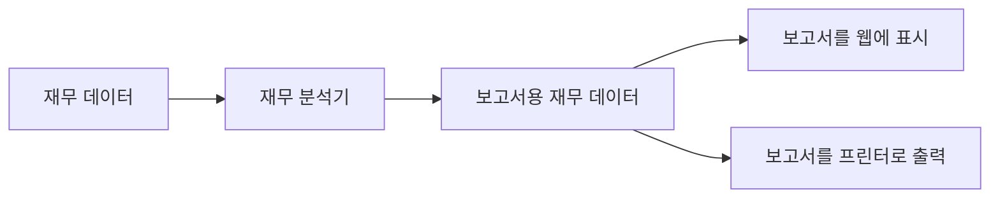
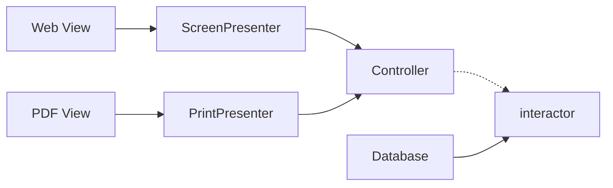

# OCP: 개방-폐쇄 원칙

개방 - 폐쇄 원칙
: 소프트웨어 개체는 확장에는 열려있어야하고, 변경에는 닫혀있어야한다.
: 행위에는 확장할 수 있어야하지만, 이 때 개체를 변경해서는 안된다.
=> 소프트웨어 아키텍처를 공부하는 근본적인 이유

## 사고 실험

소프트웨어 아치텍처가 훌륭하다면 변경되는 코드의 양이 가능한 한 최소화 될 것이다.

단일 책임 원칙을 적용하면 데이터 흐름을 아래 그림과 같은 형태로 만들 수 있다.

[재무제표를 웹으로 보여주는 시스템]

여기서 얻을 수 있는 영감은 생성이 두 개의 책임으로 분리된다는 사실

- 보고서용 데이터를 계산하는 책임
- 데이터를 웹으로 보여주거나, 종이에 프린트하기 적합한 형태로 표현하는 책임

-> 이렇게 책임을 분리했다면, 두 책임 중 하나에서 변경이 발생하더라도 ㄷ다른 하나는 변경되지 않도록 소스 코드 의존성을 확실히 조직화 해야한다.

또, 새로 조직화한 구조에서는 행위가 확장될 때 변경이 발생하지 않음을 보장해야한다.

=> 이런 목적을 달성하려면, 처리 과정을 클래스 단위로 분할하고, [재무 데이터]와 [보고서용 재무 데이터]를 컴포넌트 단위로 구분해야한다.

처리과정을 클래스 단위로 분할하고, 클래스는 컴포넌트 단위로 분리한다.

> 열린 화살표를 점선으로 대체

- 화살표의 의미
  - 열힌 화살표: 사용관계
  - 닫힌 화살표: 구현이나 상속 관계

- 화살표는 오직 한 방향으로만 교차한다.
  - A -> B인 경우, A 변경시 B에는 영향 없음
  - A 컴포넌트에서 발생한 변경으로부터 B 컴포넌드를 보호하려면 반드시 A가 B를 의존해야함

- Interceptor는 다른 모든 것에서 발생한 변경으로부터 보호하고자 한다.
  - Interceptor는 OCP를 가장 잘 준수할 수 있는 곳에 위치
  - Interceptor가 특별한 곳에 위치해야하는 이유: Interceptor가 업무 규칙을 포함하기 때문, application에서 가장 높은 수준의 정책을 포함

- 보호의 계층구조가 "수준"이라는 개념을 바탕으로 어떻게 생성되는지 주목하자.

  - Interceptor는 가장 높은 수준의 개념, 따라서 거의 보호를 받지 못한다.
  - Presenter는 View보다 높고 Controller나 Interceptor보다는 낮은 수준

- 아키텍트는 어떻게, 왜, 언제 발생하는지에 따라서 기능을 분리하고, 분리한 기능을 컴포넌트 계층구조로 조직화 한다.

## 방향성 제어

`FinancialDataGateway` 인터페이스는 `FinancialReportGenerator`와 `FinancialDataMapper`사이에 위치하는데 이는 의존성을 역전시키기 위해서다.

## 정보은닉

FinancialReportRequest 인터페이스는 FinancialReportController가 Interceptor내부에 대해 너무 많이 알지 못하도록 막기 위해 존재한다.

없었다면 Controller는 FinancialEntities에 대해 추이 종속성을 가지게 된다.

> 추이 종속성
>
> : 직접 사용하지는 않지만, 의존하고 있는 무언가가 또 다른 무언가를 의존할 때 생기는 간접 의존 관계를 의미
>
> "자신이 직접 사용하지 않는 요소에는 절대로 의존해서는 안된다"는 원칙을 위반하게 됨

## 결론

OCP의 목표는 시스템을 확장하기 쉬운 동시에 변경으로 인해 시스템이 너무 많은 영향을 받지 않도록 하는 데 있다.

이러한 목표를 달성하려면 시스템을 컴포넌트 단위로 분리하고, 저수준 컴포넌트에서 발생한 변경으로부터 고수준 컴포넌트를 보호할 수 있는 형태에 의존성 계층 구조가 만들어지도록 해야한다.
