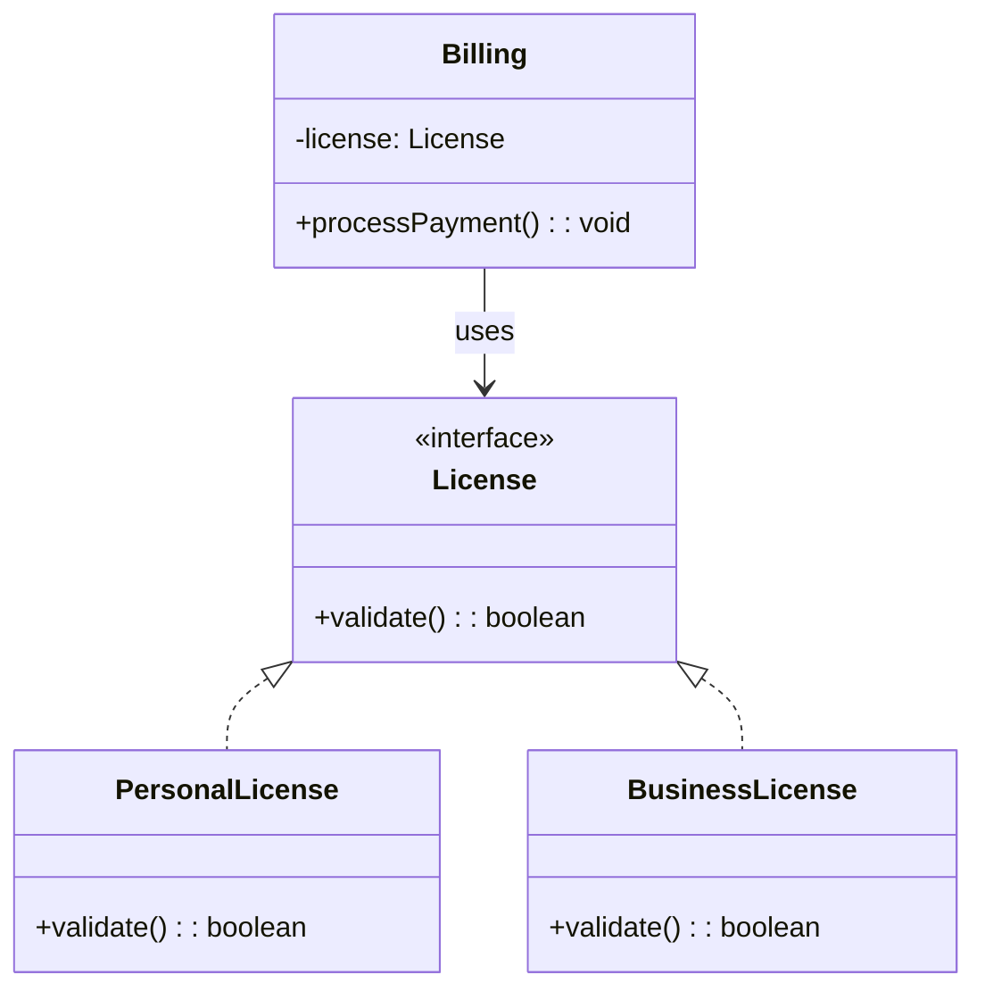
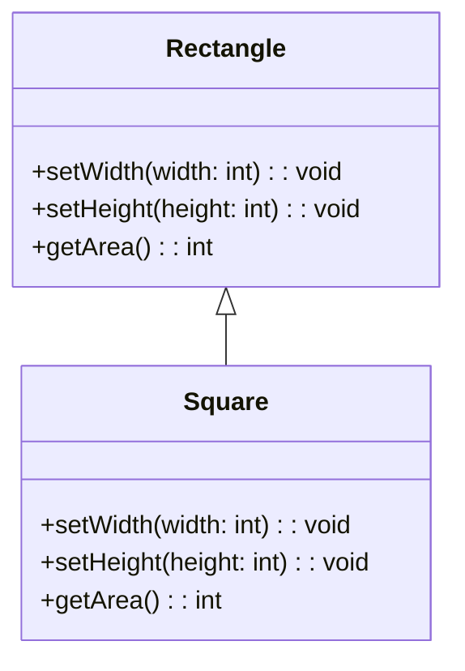

# LSP: 리스코프 치환 원칙

프로그램에서 S타입 객체 `o1`와 T타입 객체 o2가 있고,
T타입을 이용해 정의한 모든 프로그램에서 `o2`의 자리를 `o1`으로 치환하더라도 프로그램의 행위가 변하지 않는다면 S는 T의 하위 타입이다.

## 상속을 사용하도록 가이드하기



이 설계는 LSP를 준수함, Billing 애플리케이션의 행위가 Lisense 하위 타입 중 무엇을 사용하는지 전혀 의존하지 않기 때문


## 정사각형/직사각형 문제



LSP를 위반하는 전형적인 문제

- 원인: 서로 다른 성질
    - Rectangle: 높이와 너비가 독립적으로 변경할 수 있음
    - Square: 높이와 너비가 독립적으로 변경될 수 없음

User가 높이와 너비를 각각 다르게 설정해도, 정사각형은 마지막에 설정한 높이나 너비를 기준으로 높이와 너비 둘 다 변경됨


- 막기위한 방법: if문 등을 이용해 Rectangle이 Square인지 검사하는 매커니즘을 User에 추가
-> 하지만 이러면 User의 행위가 사용하는 타입에 의존하게 됨 => 서로 치환할 수 없음

## LSP와 아키텍처

LSP는 처음엔 상속을 사용하는 가이드정도였는데, 이후 인터페이스와 구현체에 적용되는 더 광범위한 소프트웨어 설계 원칙으로 변모

아키텍처 관점에서 LSP를 이해하는 최선의 방법은 이 원칙을 어겼을 때 시스템 아키텍처에서 무슨 일이 일어나는지 관찰하는 것

## LSP 위반 사례

예제: 택시 서비스 통합 application

- 기존 배차 URL
```text
{택시 회사 도메인}/driver/{driver name}/{배차 관련 정보}
```

만약 특정 택시 회사 도메인에서만 다르게 처리해야한다면, 아래와 같은 처리가 있어야한다.
```java
if(dispatchUri.startWith("특정 회사 도메인"))
```

-> 이해할 수 없는 온갖 종류의 에러가 발생할 여지가 만들어짐

아키텍트는 이 같은 버그로부터 시스템을 격리해야한다.
차라리 이 설정 정보를 가지고 있는 DB나 Map을 이용한다.


## 결론

LSP는 아키텍처 수준까지 확장할 수 있고, 해야만 한다.
치환 가능성을 조금이라도 위배하면 시스템 아키텍처가 오염되어 상당량의 별도 메커니즘을 추가해야 할 수도 있다.