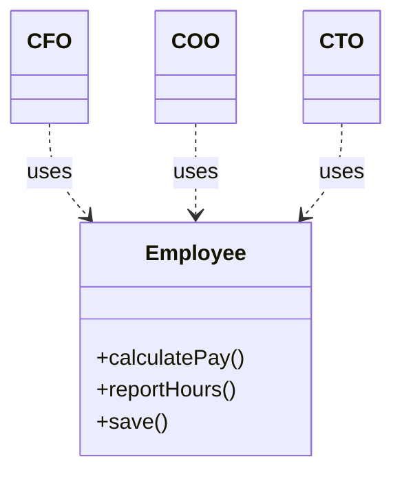
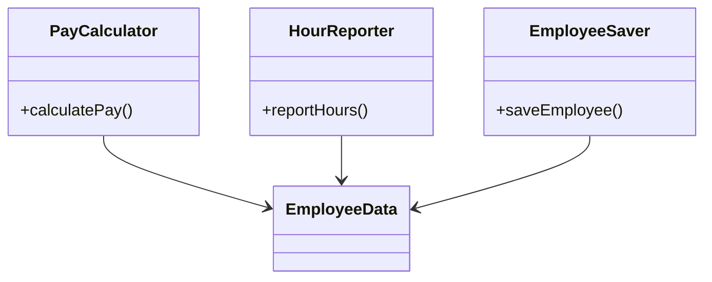
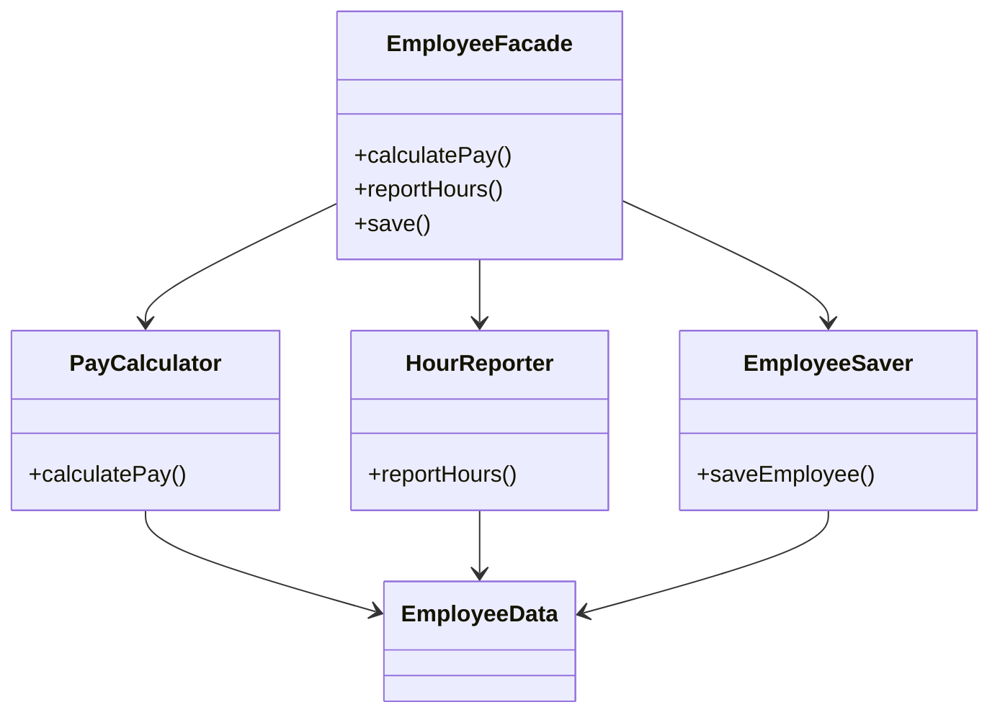
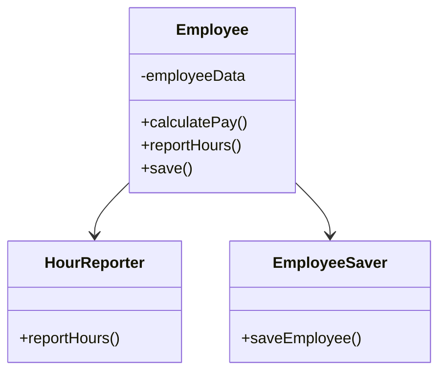

# 7장 SRP: 단일 책임 원칙
SOLID 원칙
- 함수와 데이터 구조를 클래스로 배치하는 방법, 클래스들을 서로 결합하는 방법
- 객체 지향에서만 사용되지 않음: 여기서의 클래스는 단순히 함수와 데이터를 결합한 집합을 의미
- 목표: 중간수준의 소프트웨어 구조가 아래와 같도록 만들기
    - 변경에 유연하다
    - 이해하기 쉽다
    - 많은 소프트웨어 시스템에 사용될 수 있는 컴포넌트의 기반이 된다.

> 중간 수준
> 모듈 수준에서 작업할 때 적용할 수 있다는 의미
> 모듈이 건물일 때, 하나의 벽돌이 될 수 있는 정도

- SOLID
    - SRP: 단일책임 원칙
        - 각 소프트웨어 모듈은 변경의 이유가 단 하나여야한다.
    - OCP: 개방 - 폐쇄 원칙
        - 시스템의 행위를 변경해야할 때, 수정이 아닌 추가로 행위를 변경 할 수 있도록
    - LSP: 리스코프 치환 원칙
        - 상호 대체 가능한 요소를 만들고, 서로 반드시 치환이 가능해야한다.
    - ISP: 인터페이스 분리 원칙
        - 사용하지 않는 것에 의존하지 않는다.
    - DIP: 의존성 역전 원칙
        - 고수준 정책을 수현하는 코드는 저수준 세부사항을 구현하는 코드에 의존하지 않는다.

이 중 SRP는 SOLID 중 가장 잘못 전달된 원칙
- SRP 의미: 단일 모듈은 변경 이유가 오직 하나여야함, 하나의 모듈은 오직 하나의 사용자 또는 이해관계자에 대해서만 책임
- 헷갈리는 의미: 함수는 단 하나의 일만 해야한다.

## 징후 1: 우발적 중복

3가지 액터가 1가지 모듈에 존재

- `calculatePay()` : 회계팀
- `reportHours()`: 인사팀
- `save()`: DBA

이후 초과 근무 시간을 제외한 업무 시간을 계산 하는 방식을 변경시, 다른 곳에서도 영향을 받음
하지만, 해당 로직을 사용하는 팀에서는 알지 못하고, 잘못계산된 값을 사용함

## 징후 2: 병합

여러 팀이 하나의 `Employee` 클래스를 각자 다른 이유로 수정하다 보면 병합 충돌이 생길 수밖에 없음.

예를 들면,
- 회계팀은 급여 계산(`calculatePay`) 관련 수정
- 인사팀은 근무 시간 기록(`reportHours`) 수정

이렇게 서로 다른 목적을 가진 기능들이 하나의 클래스에 얽혀 있다 보니, 같은 파일을 수정하다가 충돌나는 상황이 자주 발생하게 됨. 
게다가 충돌 처리하다가 다른 기능에 영향을 줄 수도 있음. 이건 SRP 위반이고, 결국 유지보수도 힘들어짐.

## 해결책

그래서 기능을 역할에 따라 아예 분리하는 게 맞음.

각 클래스는 각자 책임만 갖고, 공통 데이터(`EmployeeData`)만 공유하는 구조.

근데 이걸 다 직접 쓰기 불편하니까, Facade 패턴을 써서 하나로 감싸줄 수도 있음.

아니면 핵심 기능만 남기고 나머지는 외부 클래스로 분리해서 위임하는 방식도 있음.

## 결론

SRP는 그냥 "하나의 클래스가 하나의 이유로만 변경되어야 한다"는 거고,  
이걸 지키지 않으면 나중에 변경도 어렵고 충돌도 계속 남.

각 기능이 어떤 팀/이해관계자의 책임인지 생각하고,  
변경의 이유에 따라 코드를 나누는 게 훨씬 나음.
