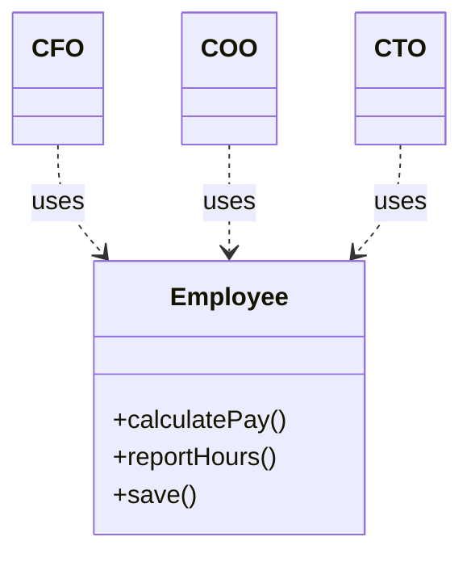
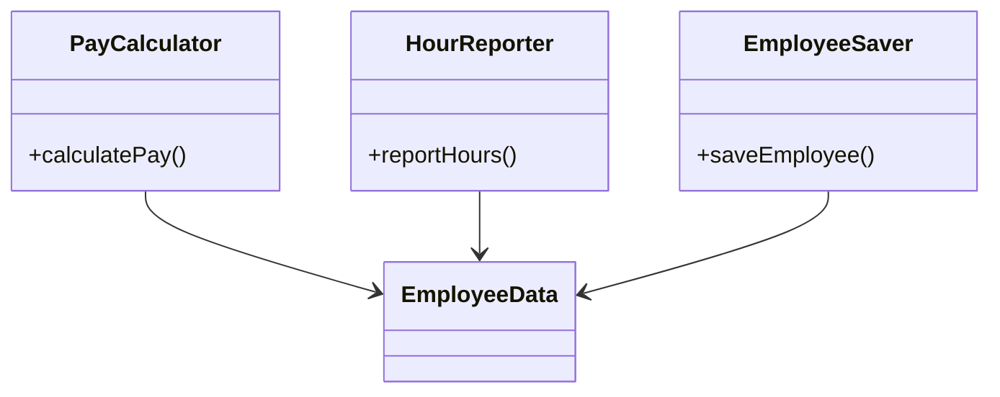
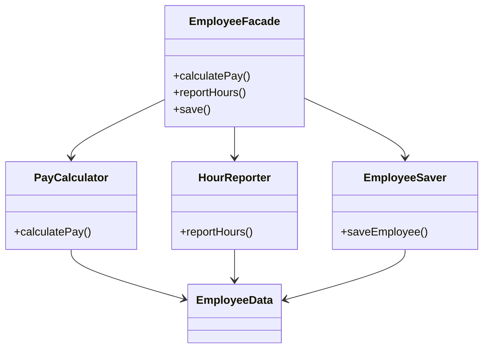
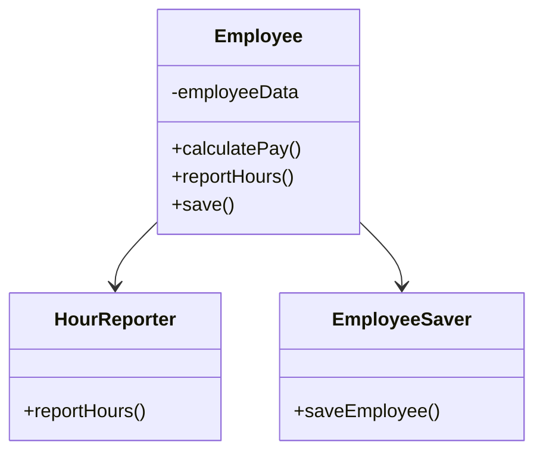

# 7장 SRP: 단일 책임 원칙

SRP는 SOLID 중 가장 잘못 전달된 원칙
- SRP 의미: 단일 모듈은 변경 이유가 오직 하나여야함, 하나의 모듈은 오직 하나의 사용자 또는 이해관계자에 대해서만 책임
- 헷갈리는 의미: 함수는 단 하나의 일만 해야한다.

## 징후 1: 우발적 중복

3가지 액터가 1가지 모듈에 존재

- `calculatePay()` : 회계팀
- `reportHours()`: 인사팀
- `save()`: DBA

이후 초과 근무 시간을 제외한 업무 시간을 계산 하는 방식을 변경시, 다른 곳에서도 영향을 받음
하지만, 해당 로직을 사용하는 팀에서는 알지 못하고, 잘못계산된 값을 사용함

## 징후 2: 병합

여러 팀이 하나의 `Employee` 클래스를 각자 다른 이유로 수정하다 보면 병합 충돌이 생길 수밖에 없음.

예를 들면,
- 회계팀은 급여 계산(`calculatePay`) 관련 수정
- 인사팀은 근무 시간 기록(`reportHours`) 수정

이렇게 서로 다른 목적을 가진 기능들이 하나의 클래스에 얽혀 있다 보니, 같은 파일을 수정하다가 충돌나는 상황이 자주 발생하게 됨. 
게다가 충돌 처리하다가 다른 기능에 영향을 줄 수도 있음. 이건 SRP 위반이고, 결국 유지보수도 힘들어짐.

## 해결책

그래서 기능을 역할에 따라 아예 분리하는 게 맞음.

각 클래스는 각자 책임만 갖고, 공통 데이터(`EmployeeData`)만 공유하는 구조.

근데 이걸 다 직접 쓰기 불편하니까, Facade 패턴을 써서 하나로 감싸줄 수도 있음.

아니면 핵심 기능만 남기고 나머지는 외부 클래스로 분리해서 위임하는 방식도 있음.

## 결론

SRP는 그냥 "하나의 클래스가 하나의 이유로만 변경되어야 한다"는 거고,  
이걸 지키지 않으면 나중에 변경도 어렵고 충돌도 계속 남.

각 기능이 어떤 팀/이해관계자의 책임인지 생각하고,  
변경의 이유에 따라 코드를 나누는 게 훨씬 나음.
