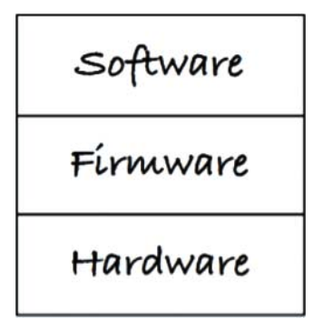

# 20장 업무 규칙

애플리케이션을 업무 규칙과 플러그인으로 구분하려면, 먼저 업무 규칙이 실제로 무엇인지를 잘 이해해야한다. 엄밀히 말하면 **업무 규칙은 사업적으로 수익을 얻거나 비용을 줄일 수 있는 규칙 또는 절차** 다.

예를 들어, 대출에 이자를 부과하는 사실은 은행이 돈을 버는 업무 규칙이다. 이러한 사실은 컴퓨터 프로그램이 계산하든, 직원이 주판으로 직접 계산하든 아무 관계가 없다.

이러한 규칙을 **핵심 업무 규칙** 이라고 부를 것이다. 이들 규칙은 **사업에 핵심이 되며, 규칙을 자동화하는 시스템이 없더라도 그 규칙 그대로 존재**하기 때문이다.

핵심 업무 규칙은 보통 데이터를 요구한다. 예를 들어 대출에는 대출 잔액, 이자율, 지급 일정이 필요하다. 이러한 데이터를 **핵심 업무 데이터** 라고 부를 것이다. 

핵심 규칙과 핵심 데이터는 본질적으로 결합되어 있기 때문에 객체로 만들기 좋은 후보가 된다. 이러한 유형의 객체를 **엔티티** 라고 부를 것이다.

## 엔티티

엔티티는 객체로서, 핵심 업무 데이터를 기반으로 동작하는 일련의 작은 핵심 업무 규칙을 구체화 한다. 

- 엔티티 **객체**는 **핵심 업무 데이터를 직접 포함**하거나, **매우 쉽게 접근**할 수 있다. 
- 엔티티의 **인터페이스**는 핵심 업무 데이터를 기반으로 동작하는 **핵심 업무 규칙을 구현한 함수**들로 구성된다.

예를 들어 그림 20.1은 Loan 엔티티(대출)가 UML 클래스로 어떻게 표현되는지를 보여준다. 

세가지 핵심 업무 데이터(`principle`, `rate`, `period`)를 포함하며, 세가지 핵심 업무 규칙(`makePayment()`, `applyInterest()`, `chargeLateFee()`)를 인터페이스로 제공한다.

_그림 20.1 UML 클래스로 표현한 Loan 엔티티_

이 **클래스는 업무의 대표자로서 독립적으로 존재**한다. 따라서 자동화 시스템의 나머지 모든 고려사항과 분리시킨다. 이 클래스는 시스템과 무관하게 작동하며, 데이터 저장방식 등과도 무관하다. **순전히 업무에 관한것** 뿐이다.

엔티티를 만드는 데 꼭 객체 지향 언어를 사용할 필요는 없다. 따라서 꼭 클래스일 필요는 없다. **엔티티의 유일한 요구 조건은 핵심 업무 데이터와 핵심 업무 규칙을 하나로 묶어 별도의 소프트웨어 모듈로 만들어야 한다는 것**이다.

## 유스케이스

모든 업무 규칙이 엔티티처럼 순수한 것은 아니다. **자동화된 시스템이 동작하는 방법을 정의하고 제약**함으로써 **수익을 얻거나 비용을 줄이는 업무 규칙**도 존재한다. 이러한 규칙은 자동화된 시스템의 요소로 존재하기에 수동 환경에서는 사용될 수 없다.

예를 들어, 은행 직원이 신규 대출을 생성 할 때 사용하는 애플리케이션을 상상해보자. "_시스템에서_ 신상정보 화면을 채우고 검증한 후, 신용도가 하한선보다 높으면 대출 견적 화면으로 진행한다" 와 같은 업무 요건을 기술했다고 치자.

이것이 **유스케이스**다. 이처럼 **유스케이스는 자동화된 시스템이 사용되는 방법**을 설명한다. 유스케이스는 사용자에게 제공하는 **입력**, 보여줄 **출력**, 그리고 **출력을 생성하기 위한 처리단계**를 기술한다. 엔티티 내의 핵심 업무 규칙과는 반대로, 유스케이스는 **애플리케이션에 _특화된_ 업무 규칙**을 설명한다.

그림 20.2 는 유스케이스의 예다. 마지막 `Customer` 에 주목하자. `Customer` 엔티티에 대한 참조를 의미하며, `Customer` 엔티티는 핵심 업무 규칙을 포함한다. 이처럼 **유스케이스는 핵심 업무 규칙을 어떻게, 언제 호출할지를 명시하는 규칙**을 담는다.

_그림 20.2 유스케이스 예제_

위의 예제에서 또다른 주목할만한 사실은, **유스케이스는 사용자 인터페이스를 기술하지 않는다는 점**이다. 따라서 유스케이스만 봐서는 이 애플리케이션이 웹을 통해 전달되는지, 콘솔 기반인지, 순수한 서비스인지 알 수 없다. 

유스케이스는 **시스템이 사용자에게 어떻게 보이는지를 설명하지 않는다.** 이보다는 애플리케이션에 특화된 규칙을 설명하며, 이를 통해 사용자와 엔티티 사이의 상호작용을 규정한다. 또한 유스케이스는 객체이기에, 애플리케이션에 특화된 업무 규칙을 구현하는 하나 이상의 함수를 제공한다.

엔티티는 자신을 제어하는 유스케이스에 대해 아무것도 알지 못한다. 이는 DIP를 준수하는 의존성 방향에 대한 도 다른 예다. **엔티티와 같은 고수준 개념은 유스케이스와 같은 저수준 개념에 대해 아무것도 알지 못한다.** 

왜 **엔티티는 고수준, 유스케이스는 저수준** 일까? 유스케이스는 단일 애플리케이션에 특화된 업무 규칙을 다루기에, 해당 시스템의 입력과 출력에 보다 가깝게 위치하기 때문이다. 반면, 엔티티는 다양한 애플리케이션에서 사용될 수 있도록 일반화된 것이므로, 각 시스템의 입력과 출력에서 더 멀리 떨어져 있다. 입력/출력에서 멀리 떨어져 있을수록 고수준이며, 가까울수록 저수준이다.

그래서 유스케이스는 엔티티에 의존하며, 엔티티는 유스케이스에 의존하지 않는다.

## 요청 및 응답 모델

제대로 구성된 유스케이스 객체라면 데이터를 사용자나 또 다른 컴포넌트와 주고 받는 방식에 대해서는 전혀 눈치챌 수 없어야 한다. 

유스케이스는 단순한 요청 데이터 구조를 입력으로 받아, 단순한 응답 데이터 구조를 출력으로 반환한다. 이들 **데이터 구조는 어떤 것에도 의존하지 않으며, 어떤 사용자 인터페이스에도 종속되지 않는다**.

이처럼 요청 및 응답 모델의 의존성을 제거하는 일은 매우 중요하다. 그렇지 않다면 결국 그 모델에 의존하는 유스케이스도 의존성에 간접적으로 결합되어 버린다.

## 결론

**업무 규칙은 소프트웨어 시스템이 존재하는 이유**다. 업무 규칙은 핵심적인 기능이며, 수익을 내고 비용을 줄이는 코드를 수반한다. 

**업무 규칙은 사용자 인터페이스나 데이터베이스와 같은 저수준의 관심사로 인해 오염되어서는 안 되며**, 원래 그대로의 모습으로 남아 있어야 한다.